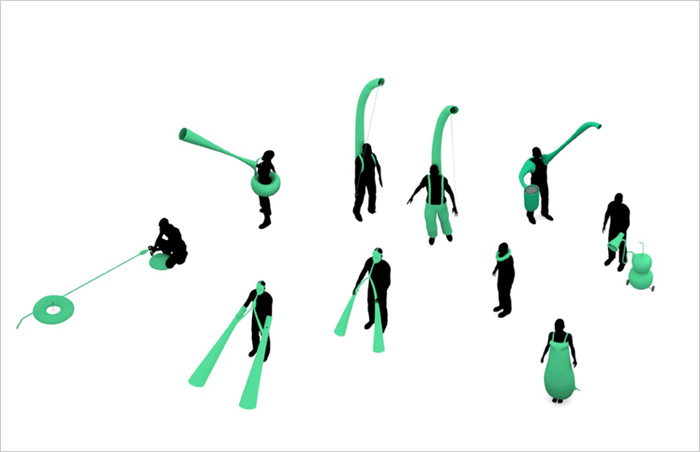
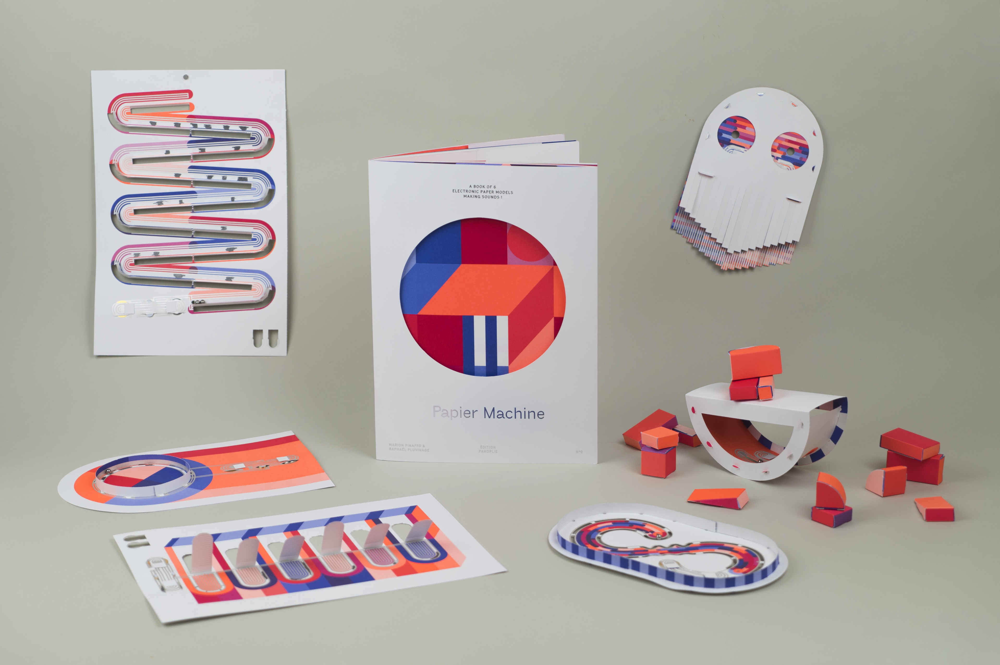

- **DESIGNS FOR AN OVERPOPULATED PLANET:** So far we have not really embraced the power to modify ourselves. What if we could extract nutritional value from non-human foods using a combination of synthetic biology and new digestive devices inspired by digestive systems of other mammals, birds, fish and insects?

    

    https://dunneandraby.co.uk/content/projects/510/0

- **Papier Machine** Objets électroniques sonores en papier.

    

    https://www.solutions-numeriques.com/special-noel-papier-machine-n0-6-objets-electroniques-sonores-en-papier-a-monter-soi-meme/

