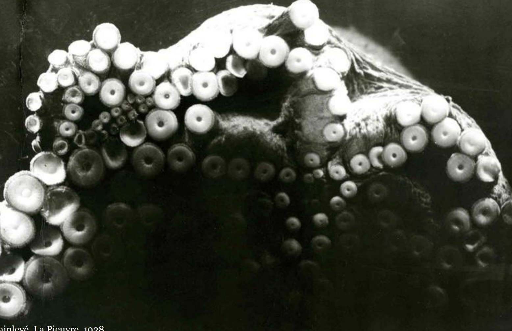

# md-soft-skin
 MASTER MODULE IN SOFT ROBOTICS

 This is the repository with all the development process of the Master in Media Design module of Soft Robotics.
 
 ## **Briefing** 
 **Fluid Interactions:** Designing soft Robotics for Domestic Spaces.

    (In collaboration with CNRS, CEA, INRIA)

   

   **Robots** -  increasingly integrated into our domestic lives

**Design** =  + flexible/sensitive/dynamic/adaptive/responsive (nature, organic systems, rhythms of life itself) 

**Terrestrial > Aquatic** - fluidity/adaptability of marine life

(Context = domestic lives)

 
Juxtaposing simple materials in unexpected ways 

**x**

Integrating new technologies **+** Familiar technologies or gestures 

(simplify complexity through poetics) 

  

**Questions**
1. How to facilitate the transition to softer forms? 
2. How to create interactions aligned with the human body? 
3. How to develop elastic/deformable interactions (objects that pulse, vibrate, and respond to touch in organic ways)? 

 ## **Schedule:** 
 
 - 14th of October 2024 to 15th of January 2025
 
 - Mid-crit: 7th of November 2024

- Final jury: 15th of January 2025

## **Guidelines:** 
- Your soft robots must be interactive.
- Your design should address a specific usage within our domestic lives.
- Your prototype should demonstrate a simple yet poetic, playful, applied and novel interaction.
- Less is more. 
- Create an engaging experience.

## **Planing:** 
**Phase 1: Observation, Field Research, and Experimentation (October 14 to October 25)**
- Understanding the world of soft robotics
- Mapping initial ideas and research, apply the methodologies taught in class. 
- Start prototype and pitch ideas.
- Compile references on soft robotics, current and future innovations, and insights (literature, science fiction, films, product design, and textile design) 
- Examine the concept of domestic spaces (field research, observations, and interviews).

**Phase 2: Intentions and Concepts (October 25 to November 16)**
- Define initial intentions, user scenarios, and possible interactions. 
- Create paper mock-ups to test and pitch our first ideas. Focus on visualizing the project intentions (mock-ups, scenarios, drawings) and preparing a presentation for our mid-critique.

**Phase 3: Prototyping (November 18 to December 20)**
- Develop scenarios and paper prototypes to illustrate and test our initial ideas. 
- Shape and form exploration.
- Prototyping (3D, electronics, etc.). 
- Continue iterating and refine the final details 
- Test day

**Phase 4: Final Development, Scenario Creation, and Presentation (December 20 to January 15)**
- Completing the project, scenario, and final production
- Create all the final assets needed for your presentation and the final jury.

## **Deliverables:** 
1. Presentation (research, goals, insights and methodology).
2. PDF detailing the key interactions of your object.
3. A Github “devlog” repository (simple notes, research, insights, code, and documentation).
4. 3D final (Fusion 360 file)
5. Mockup of your concept (paper).
6. Short movie showing your soft robots in action (max 1min)
