# md-soft-robotics: Skin
 During the first days of the module of Soft Robotics, it was defined that the choosen area of interest to perform the research in the subject would be the SKIN.
 
 ## **Wordstorm: Soft Robotics** 
  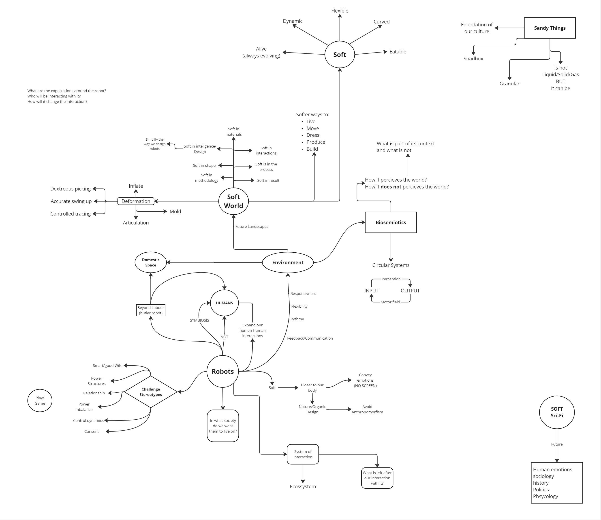

 **Insights:**
- Work with Symbiotic relationships
- What does a SOFT WORLD looks like?
- Build an Ecossystem of Interaction
- The SOFT is:
    - Always evolving (alive);
    - Flexible
    - Curved
    - Eatable 

1. What are the expectations around this robot?
2. Who will be interacting with it?
3. How will it change the interaction?

## **Dynamic: Card Draw** 
 Quick prototype ideas of possible robots, based on different combinations of words (Gesture /Soft characteristic /Relation /Sensor (Input) /Feedback (output) /Domestic behavior)

 **Robot01: Dumbo Tree**
  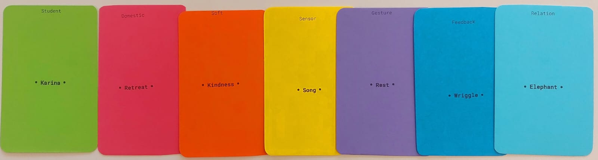
  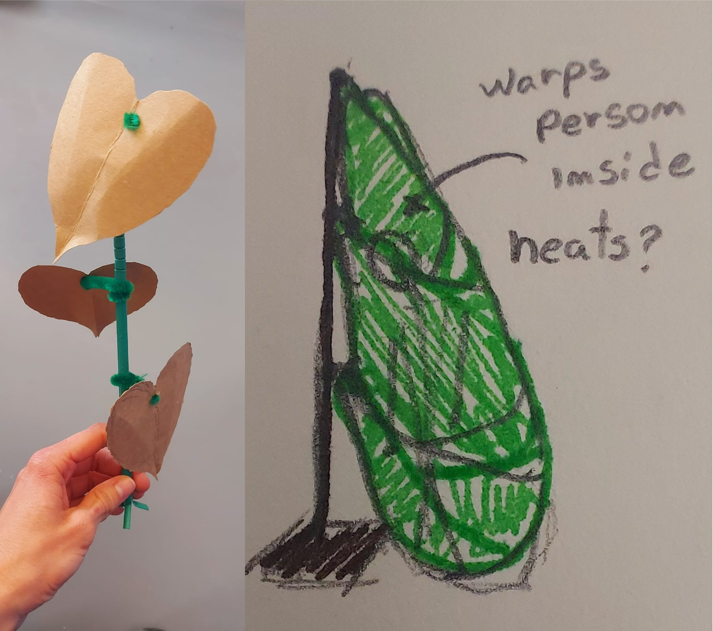

Dumbo Tree is a robot tree that can be placed as decoration near a bed or couch. If it hears a person crying or making any kind of distressed sound, its leaves will reach down in a wriggling movement, and warp the person in a cocoon-like hug.
  
  **Robot02: Secret Whisperer**
  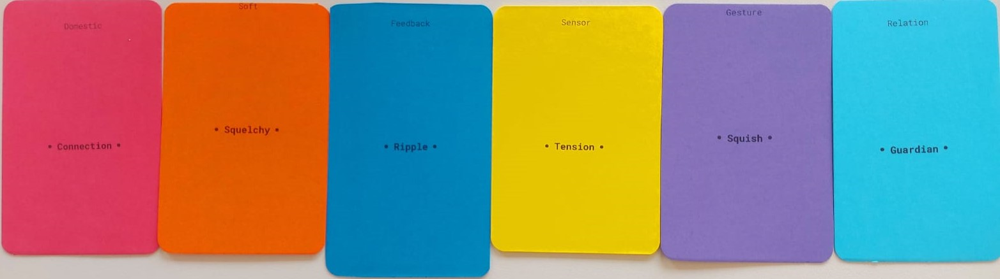
  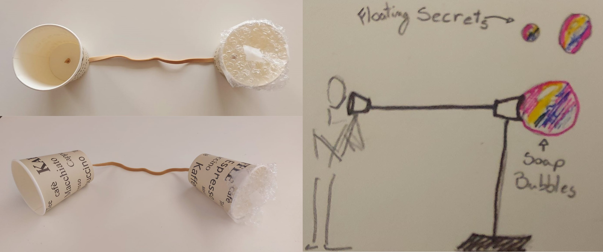

Secret Whisperer is a communication device to which one can tell secrets. The secret can be whispered in one extremity and its waves will travel to the other side, being encrypted and stored in a bubble.

## **Wordstorm: Domestic Life** 
  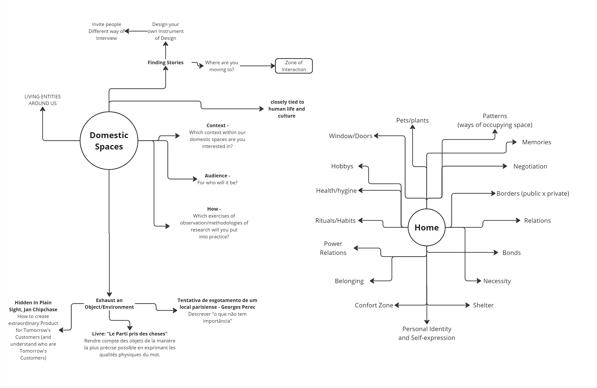

 **Insights:**
- HOME is a place of:
    - Personal Identity
    - Self-expression
    - Patterns (ways of occupying space)
    - Rituals/Habits
    - Borders (public x private)
    - Belonging
    - Confort Zone

## **Wordstorm: Skin** 
  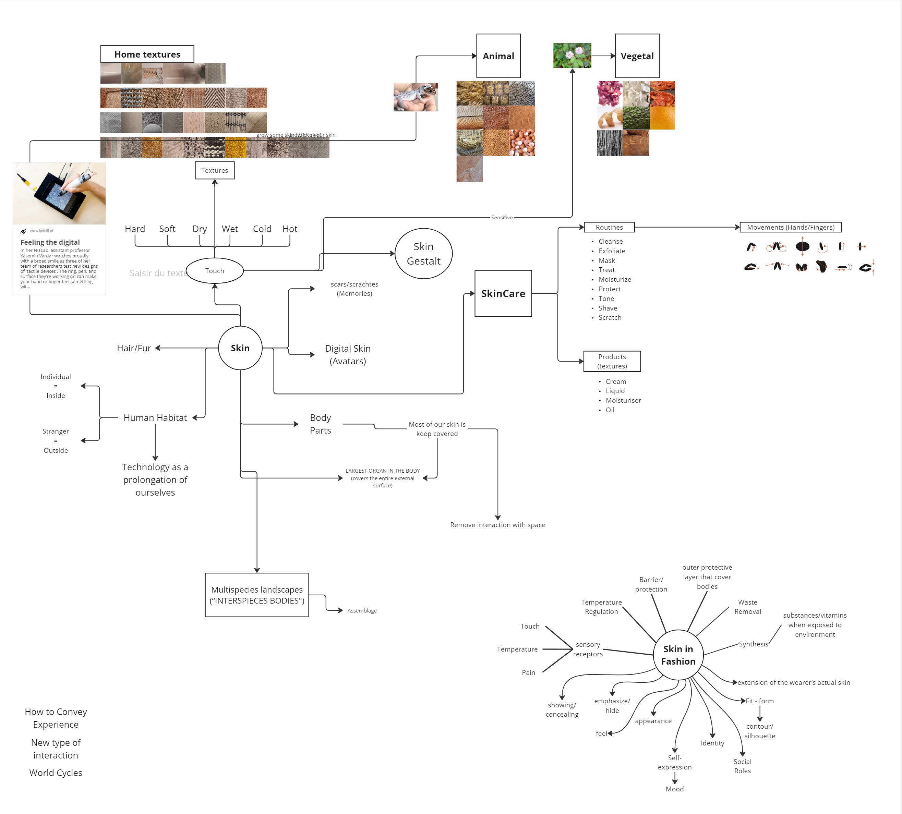

 **Questions:**
- What is a skin?
- What is not a skin?
- How does it feel?
- How does it sound?
- How does it taste?
- How does it smell?
- How does it look?
- What does it serve for?
- How does it change during day/month/year?
- How elastic can it be/how much can you deform it?
- What kinds of things grow from it?
- What patterns can it make?
- How many states does it have?
- How can you join skins?
- How can you separate them?
- How does 2 pieces of skin can interact?
- How many layers can you overlay before it becames hard?
- What is the hardest skin on the planet?
- What is the softer skin on the planet?
- How many textures can it have?
- How it reacts to heat/cold?
- How it reacts to different textures?
- How/Why do we hide it?
- What kind of cerimonies are linked to Skin?
- How can we interact with skin?
- Where is the inteligence on the skin?
- Where does skin starts?
- Where does it ends?
- What would happen if the skin was an independent living creature?
- What are it motor functions?

## **Exercices d'observation** 
### **Expressions with Skin**
Reserach on different expressions used in multiple languages containing the word SKIN as a metaphor.

       English
1. **Thick-skinned** – Someone who is not easily offended or hurt by criticism or insults.
2. **Thin-skinned** – Opposite of thick-skinned
3. **By the skin of one's teeth** – Barely managing to do something or just avoiding failure or disaster.
4. **In someone's skin** – Imagining yourself in another person's situation.
5. **Save someone's skin** – To help someone avoid trouble or danger.
6. **Jump out of one's skin** – To be extremely startled or scared.
7. **Comfortable in one's own skin** – Feeling confident and accepting oneself.
8. **Shed one's skin** – To undergo a significant change or transformation, often for the better.
9. **No skin off my nose/back** – Not a concern or inconvenience for someone.
10. **Get under someone's skin** – To irritate or provoke someone over time.
11. **Skin in the game** – To have a personal investment or risk in an undertaking.
12. **Skin-deep** – Something that is only superficial or shallow.

        French
1. **Avoir la peau dure** – Être résistant, difficile à abattre ou à affecter.
2. **Sauver sa peau** – Échapper à un danger, se sauver soi-même.
3. **Être bien dans sa peau** – Être à l'aise avec soi-même, avoir confiance en soi.
4. **Avoir la peau sur les os** – Être très maigre.
5. **Changer de peau** – Se transformer, changer radicalement.
6. **Avoir la peau de quelqu’un** – Vouloir se venger ou faire du mal à quelqu'un.
7. **Ne faire qu'une peau** – Former un tout, être très proche.
8. **Être dans la peau de quelqu’un** – Se mettre à la place de quelqu’un, comprendre sa situation.
9. **Se sentir à l’étroit dans sa peau** – Ne pas se sentir bien dans sa propre situation ou identité.

        Portuguese
1. **Ter a pele dura** – Ser resistente, não se deixar abalar facilmente.
2. **Salvar a própria pele** – Fugir sozinho
3. **Salvar a pele de alguém**– Ajudar alguém a escapar de uma situação perigosa ou difícil.
4. **Sentir-se bem na própria pele** – Estar confortável e confiante consigo mesmo.
5. **Estar na pele de alguém** – Colocar-se no lugar de outra pessoa, entender sua situação.
6. **Arrancar a pele de alguém** – Criticar severamente ou vingar-se de alguém.
7. **Pele e osso** – Ser muito magro, quase sem carne no corpo.
8. **Ficar com a pele arrepiada** – Sentir arrepios de emoção ou medo.
9. **Trocar de pele** – Passar por uma transformação ou mudança significativa.

**Insights:**
- Many SKIN expressions repeat themselves in multiple languages;
- The position/status of the SKIN seems to follow a similar logic in multiple occidental cultures

---

### **Skin Mapping**

Series of macro photographs made from different parts of the same body.

**PATTERNS**
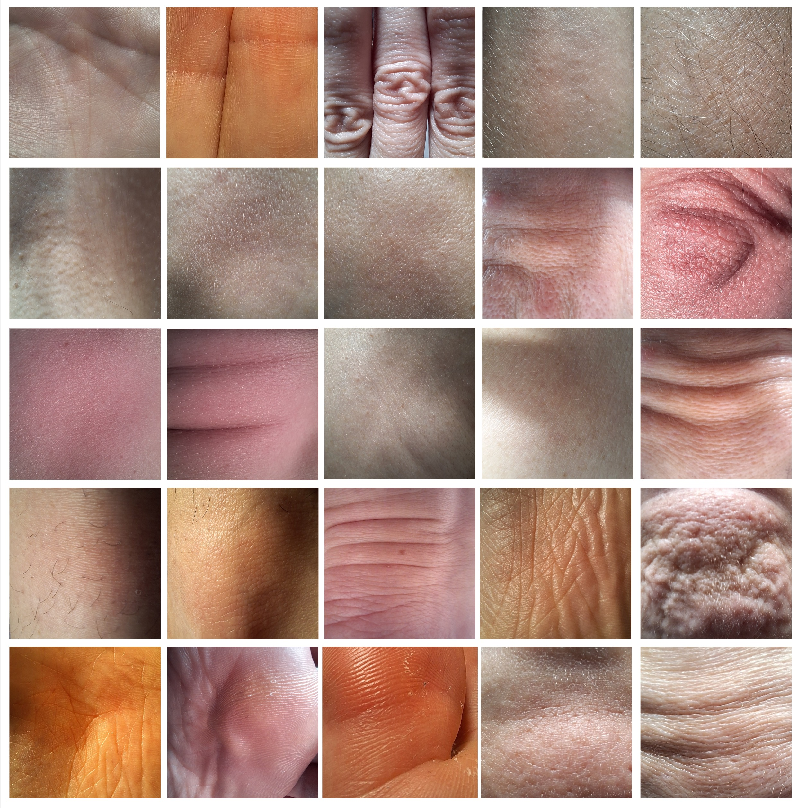

**EMOTIONS**
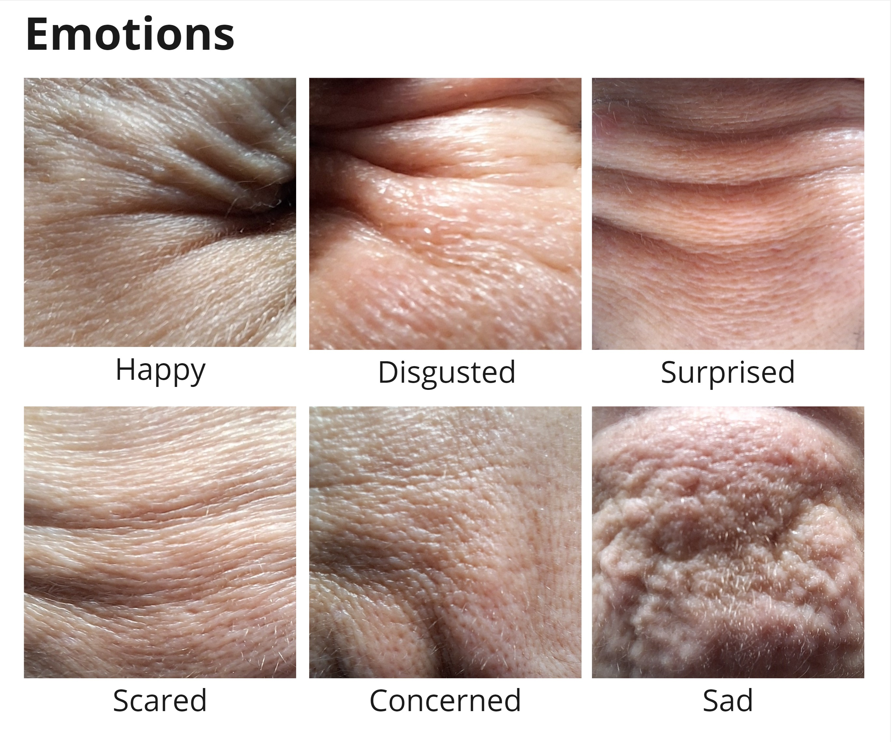

**Insights:**
- The skin has many different patterns and thicknesses depending on the part of the body it is
- Emotions are transmitted through the skin in the form of folds (SKIN LANGUAGE?)

---

### **Domestic Skins**

Series of photographs listing all kinds of skin creatures found inside the domestic space. After identifying them, the skins were classified in groups depending on their specific characteristics. This exercise also helped pinpointing some specific motions quite particular to skins.

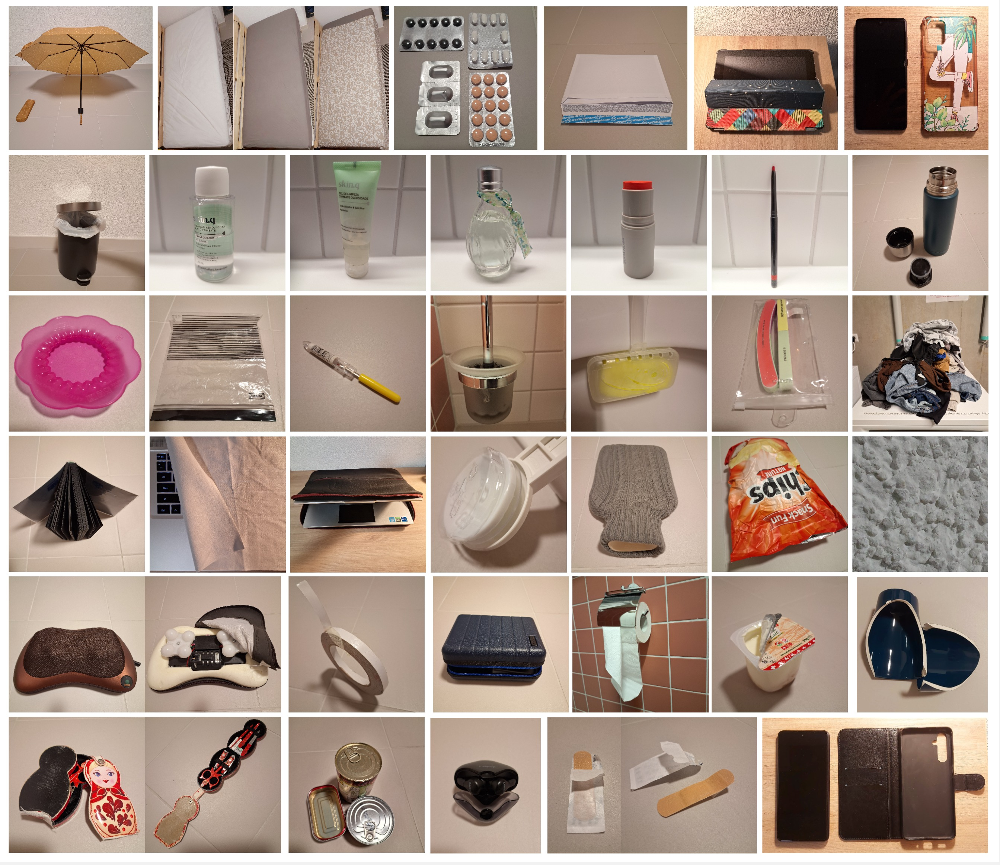

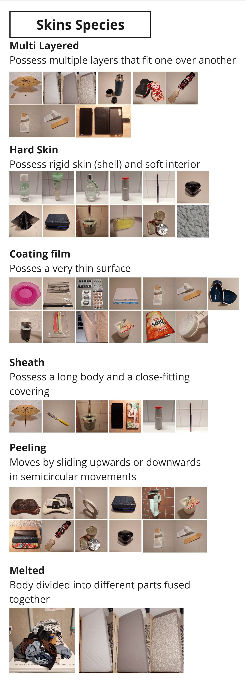

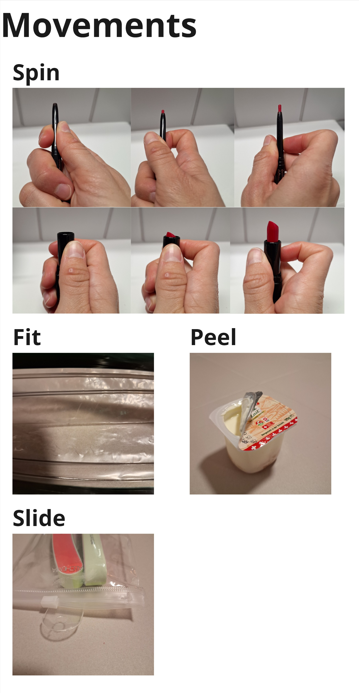

 After listing all skin subspecies, some of them were choosen for a narration exercice, in which they were described as independent creatures.

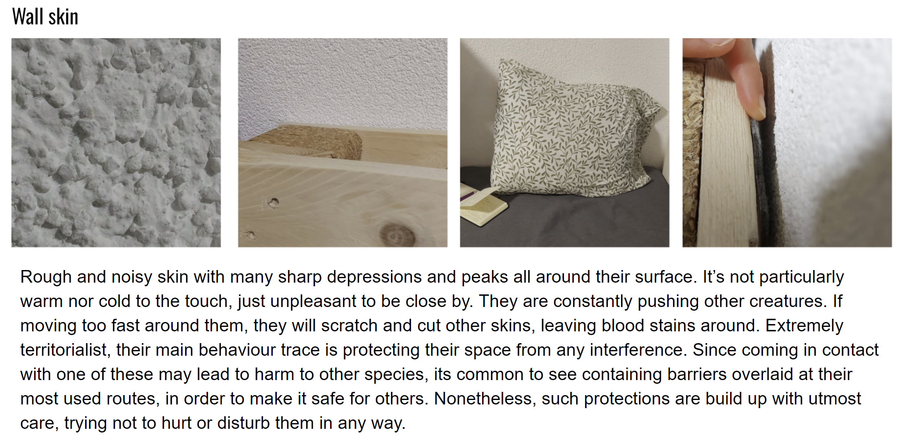
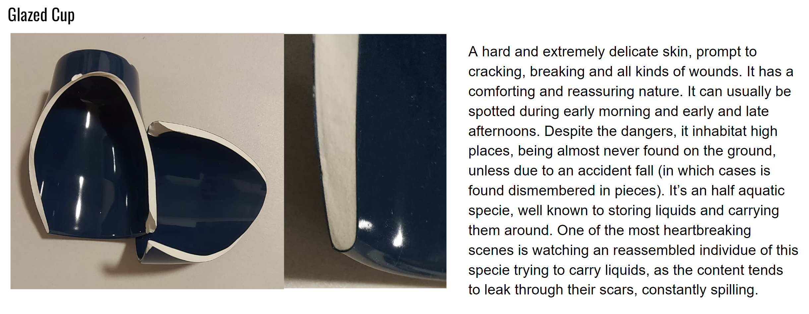
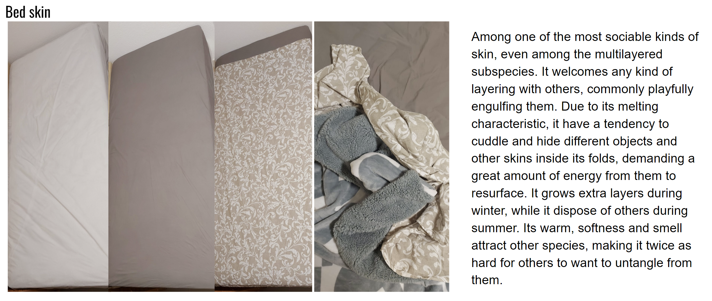
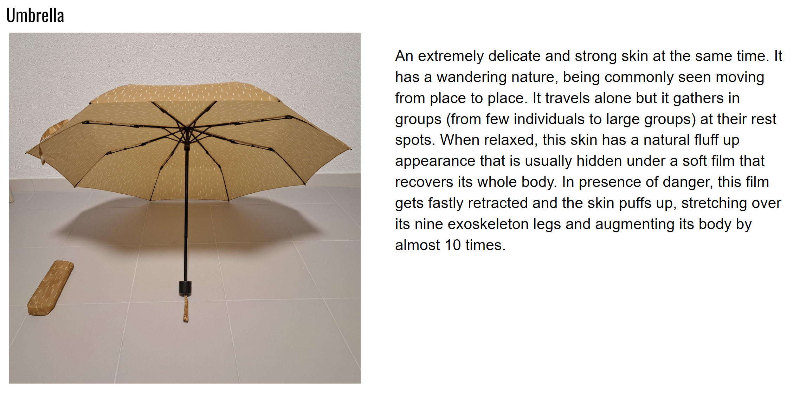

**Insights:**
- Skins can appear in many forms, even as domestic objects;
- what defines an object as a skin can be:
    - its protection functionality
    - the kind of movement requested for interaction
    - comfort characteristic
    - multiple overlayerings
    - elasticity
