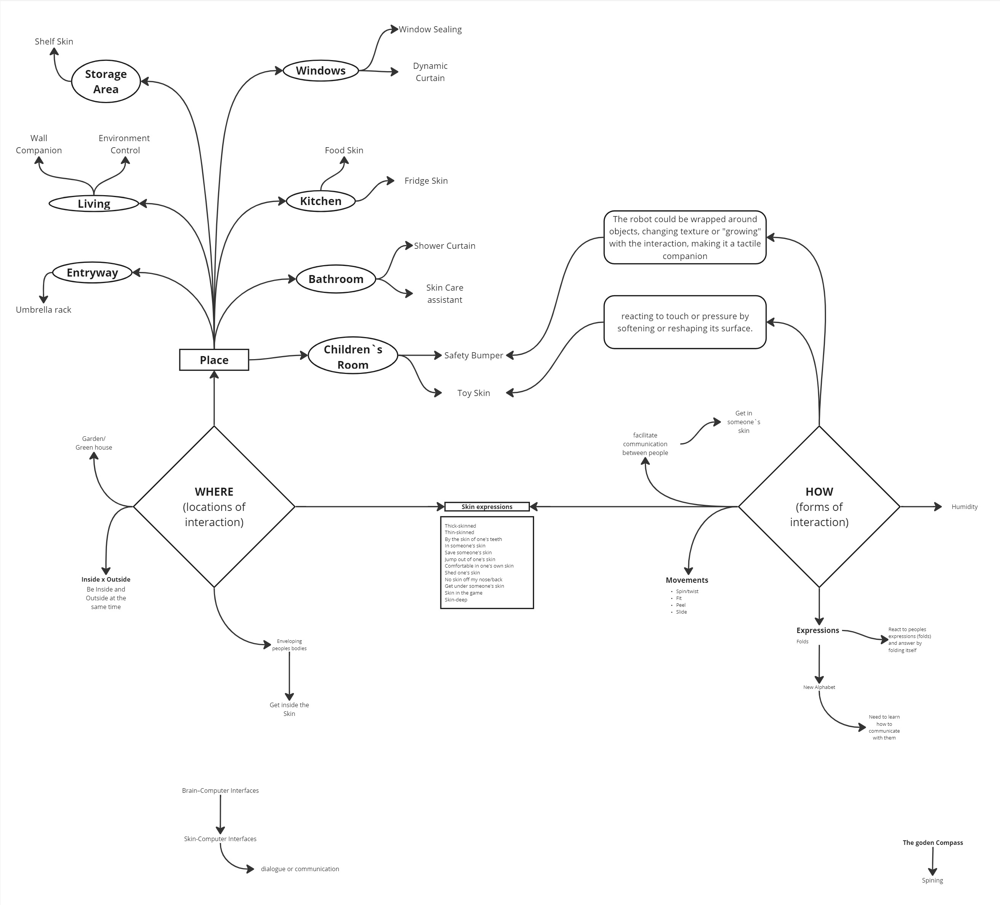
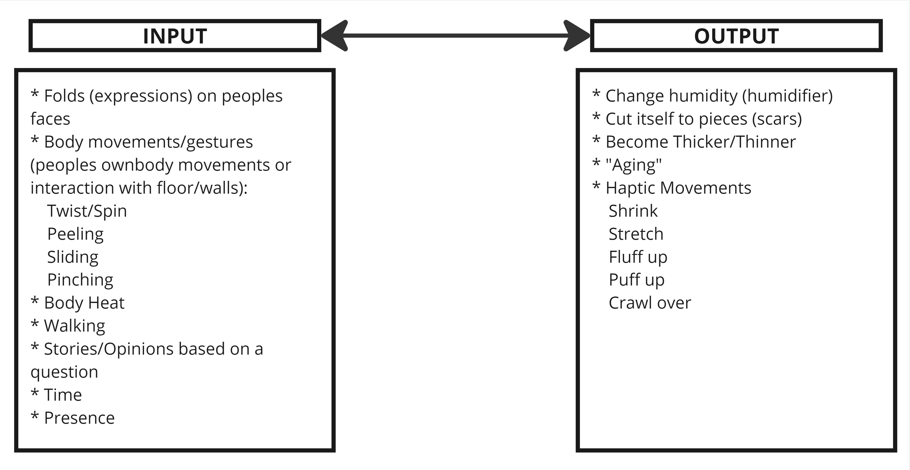
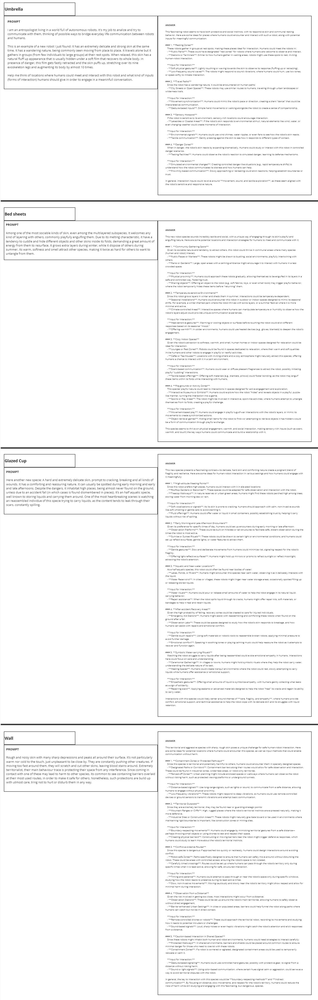

# md-soft-robotics: Skin
 This phase was used for growing a better definition of the project's concept and thinking about what kinds of INPUT and OUTPUT would be used for mediating the interaction between the robot and its users.
 
 ## **Interactions** 
 How the robot will communicate and engage with humans. how people and automated systems communicate and respond to each other (exchange of information, actions, responses).

    Think in 1 key interaction (1 form of iterating with people) - think about storytelling/ one simple action/1 simple interaction/mechanics

- **What** question it addresses?
- **Who** interacts with?
- **How** do these subjects interact? (what type of gestures/ feedback it gives)
- **Why** (for what reason) is interaction taking place?
- **Where** (under what condition) the interactions is taking place?

### Concepts to work with
1. **Agency** - user's sense of control (perform meaningful actions and impact the outcome/ sense of control/ choices translated into real changes, impact on the outcome) 
    - designer must provide tools and opportunities for the engagement and feedback system
2. **Personality** - How it communicate (interaction/story)
3. **Feedback** - information that you provide to the user in result of their actions (haptic response/text/sound) 
    - Cybernetic Loop - constantly adjusting to each other (rithm/body gestures)//boat 
    - communication is not linear, forms circular process where the output of a system affects its input/ self-regulating mechanism 
    - not a direct communication (poetic)
4. **Input/Output**

---

### Exercises

**Exercise 1:**
Brainstorm of possible areas; specific situation where the soft robot could be used or interact within a home environment.

**Exercise 2:**
Building on the ideas from exercise 1, create a list of potential interactions and feedback mechanisms. Focus on how it communicate with its environment and users - Input-output.

**Exercise 3:**
Using ideas from 1+ 2 exercises, write a short paragraph in markdown that describes what your soft robot does, where it resides in the home and who interacts with. Feed this text to an AI and begin an interactive process to refine concept (ChatGPT; HuggingChat, V0 (code); Gemini, Claude).

## **5Ws DESIGN** 
 
    - What -
    What is it? What does it do?

    - Where -
    Where does it exist? Describe places in your home where you think you would like to keep the object and the reason why. Under what conditions is interaction taking place?

    - Who -
    For who is it?

    - How -
    How does it behave? How do people get the information they need? How do they interact with it? How does it communicate?

    - Why -
    Why does it exist? For what reasons is interaction taking place?

