# Notion of Electronics - Pierre 

## Components
- **Soldering Iron** - Make mechanical and electronical connections between components
- **Multimeter** - Measure different values in electronic circuits,  voltage (power), resistence and amperage 
- **Breadboard** - Make quick electrical connections between components to make fast prototypes before soldering them.

 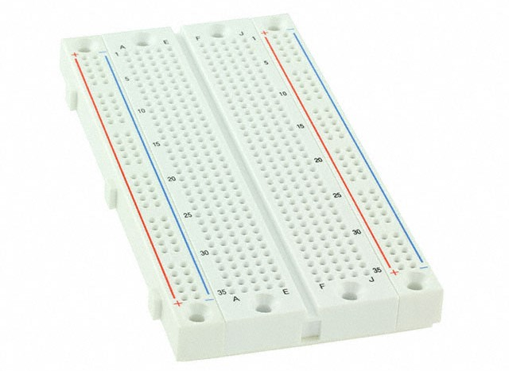
- **Streetboard** - board use to sold components togethet (have copper circuits connections)

 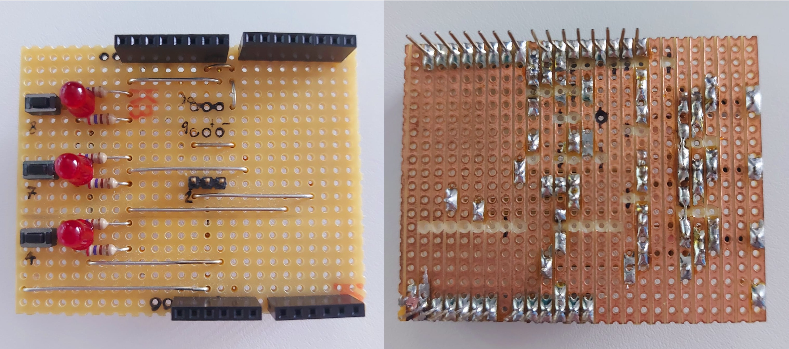
- **PCB (printed circuits board)** - electronic board made 

 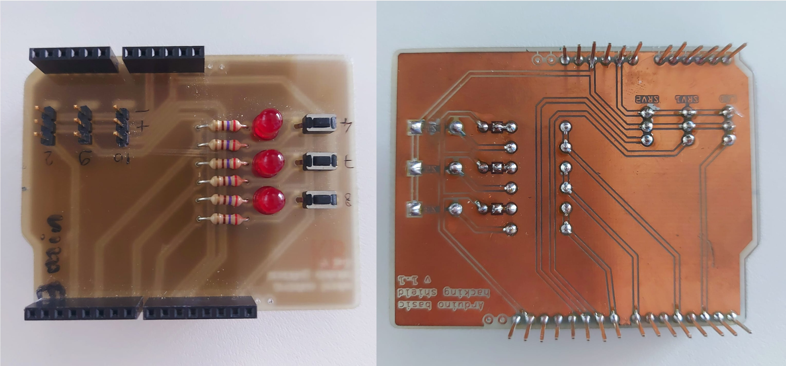
- **Solder pump** - suck the solder to remove it from a board
- **Solder wire** - melted when heated in order to create a solder
- **Wire (soft - maleable wire /hard - mantain shape)** - to make a bridge from one part of a board to another to pass on information
- **Vice** - hold a piece in place while your hands are being used to build the circuit/soldering

- **Microcontrolers**
    - Arduino (nano, uno, mega)

    
    - ESP32 (do the same thing as arduino but is smaller and already come with bluetooth/wi-fi)

    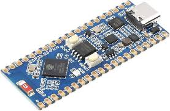
    - ATtiny85 (cosumes less battery than isb32/ can be put in sleep mode and consume almost 0  battery and be activated remotely to wake once a day to make measures and go back to sleep)

    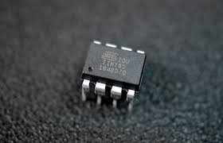

- **Resistors**
    - Dissipate watts - (loses energy and creates heat)
    - Voltage is kind of a pressure. The battery whants to exit the energy from one point and regain electrycity from the other.
    - Energy does not flows naturaly like water. It stays in the same place unless prompted to move (you cannot just open a tap and eletricity will flow). In other for the energy to move, a circuit is needed; open circuits don't work. 
    - A current = flow of energy

- **Transformers**
    - Transform the energy to higher or lower values

## Resistor
- A voltage across a resistor causes a current;
- The voltage pushes the current out and make it move
- The resistor apply resistence to the current and make it harder for it to pass.
- Higher Voltage = Higher Current
- Higher Resistence > lower Current 
    
        I - intensity of the current (amphère) [A]
        U/V - voltage [V]
        R - resistence [Ω/ohm]

        AC - alternative current (current flows continously bettween 0 - 300v; 50x by second[measured in hz])
        DC - direct current (allways have the same voltage)

**Open circuit x Short Circuit**
- Open circuit 
    - when there is no passage from the positive to the negative poles (infinite resistence)
    - Zero current: the current does not flow
    
- Short Circuit
    - zero resistence/ no limit to the energy going through - current (it will give everything it can and create a lot of heat until it burns)
    - infinite current (theoretically, but not in practice because the resistence is never really 0, even in cooper wire)

Air = has a big resistence (that's why electricity needs wires to pass; it cannot pass throug positive+negative and create a short circuit by itself)
Skin = 1,831MΩ - big resistence
Every component have a resistence

## Ohm's Law
         U  =  R * I
        [v] = [Ω]*[a]

**Voltage**
- Name: U
- Unit: volt
- Symbol: [V]

**Current**
- Name: I
- Unit: amphere
- Symbol: [A]

**Resistence**
- Name: R
- Unit: ohm
- Symbol: [Ω]

  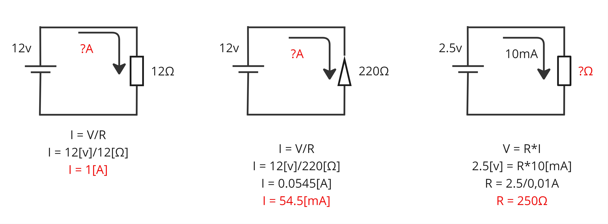

  ## Joule Effect (power)
  - A resistor through which a current flow consumes a certain amount of electrical energy and transforms it into heat.
  - Arduino resistors can support up to 0.5W of power. More that that, it will make them heat to much and break.
  - Small wires (arduino) cannot undergo more that 1A for a longt time. The wire will heat too much and melt the insulation 

  **Power**
- Name: P
- Unit: watt
- Symbol: [W]

        P = U * I
        P = R * I²
        P = U²/R

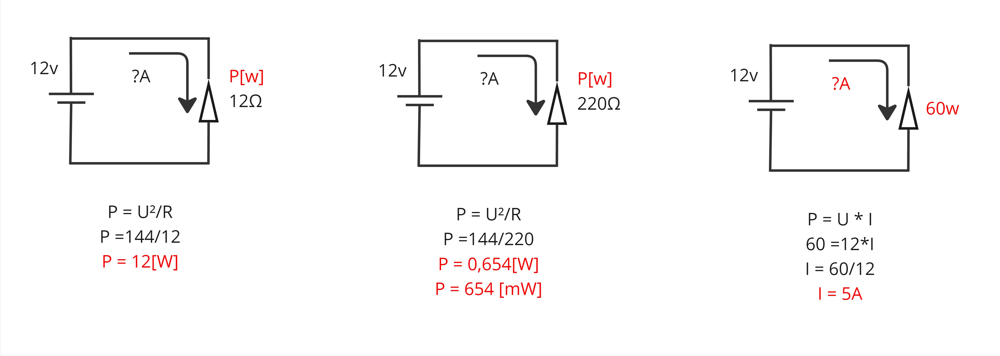

**Voltage divider**
In series, the voltages add up
        U = U1+U2

The current through the two resistors are the same.
The objective is to reduce the voltage in the end (U2) to make sure we don`t have more volt/current then our component can take.
        U1= R1*I
        U2 = R2*I
        U = (R1+R2)*I

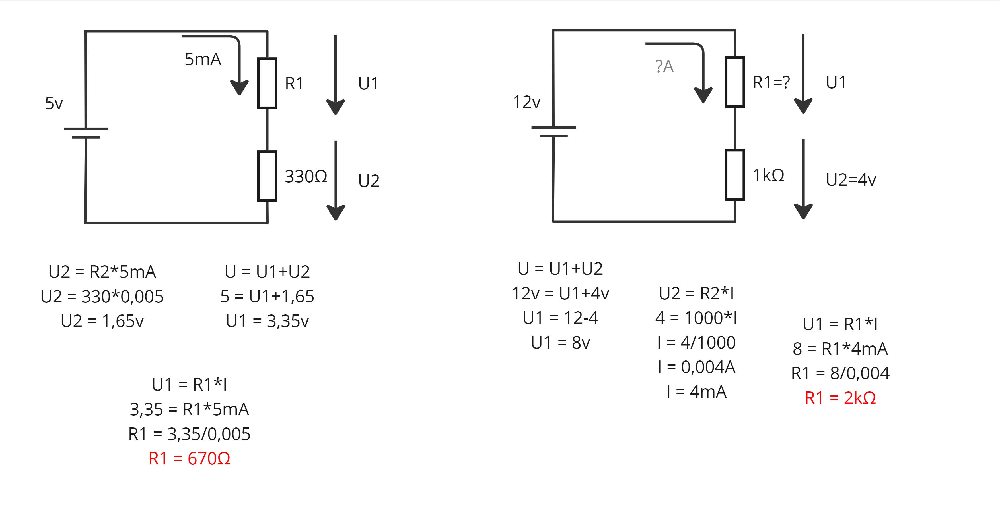

**LED (Light-Emitting Diode)**
- A diode will let a current go in only one direction. In the opposite way, it will block th current (Anode [A] = +/ Cathode [K] = -).
-  It can be used to transform CC to CD (need an array of 4 diodes) - **GRAETZ**
- Normally, diodes don't emite light. LED are bad diodes, that don't block current but, instead, produces light.
- Different Led's colors respond/work in different currents lenghts (mA), in which they will consume different amounts of voltage.
- LED ref: 2,2V/ 20mA
- Arduino maximum current = 

Calculate the resistence of a LED:

        R = Us-U2/I2

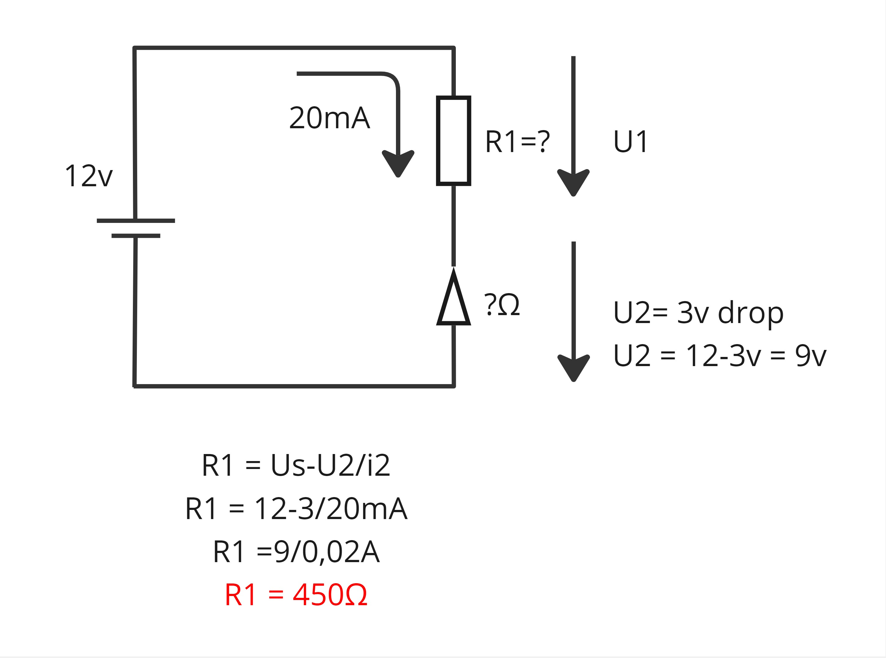

* When connecting external components to the arduino (ex. step motor) that requires more energy then the arduino can provide (5V), you can power the component with an external font, but the GND of both Component + Arduino need to be connected, to have the same parameter.

* Arduino mp3 player shield - have a sd card entrance and jack output. When connected to the Arduino, it can be turned into an mp3 player.

                - Vin (Voltage in): pin used to power the arduino with an external battery
                - 2-13 (Digital input/output): digital pins used for both inputs+outputs. Work with two values = 1 or 0 (HIGH and LOW). 
                - Some digital pins have PWM - pulse wave modulation(~): They receive analog messages from 0 (off) to 255 (on). Usually, the PWM function is available on pins 3, 5, 6, 9, 10, and 11.  
                - A0-A5 (analog inputs/outputs):  An analog signal is one that can take on any number of values. The function that you use to obtain the value of an analog signal is analogRead(pin). This function converts the value of the voltage on an analog input pin and returns a digital value from 0 to 1023, relative to the reference value.
                 - TX>0 (info transmiter)/RX>1 (info reception): careful when use, because it keeps sending messages to the arduino through the same entrance this one uses to run the code. It may block the info passage.

### *Blinking a LED*
**Build**
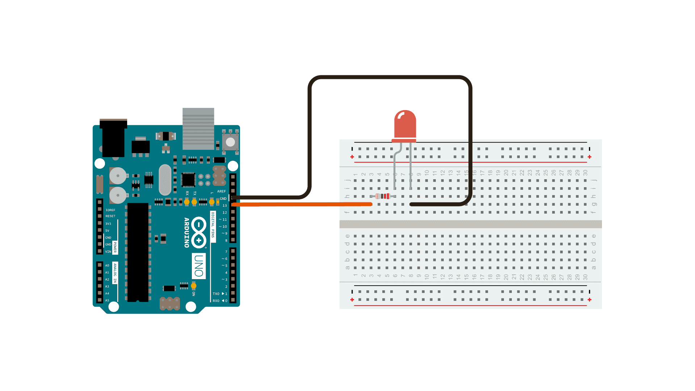

**Code**

                int led = 13;

                void setup() {                
                pinMode(led, OUTPUT);  //turn pin13 into an Output
                }

                void loop() {
                digitalWrite(led, HIGH);  //send 5v to pin13
                delay(1000);             
                digitalWrite(led, LOW);  //send 0v to pin13
                delay(1000); 
                }

### *Blinking a rgb LED*
**Build**
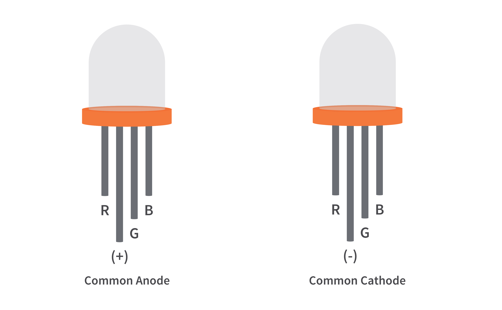
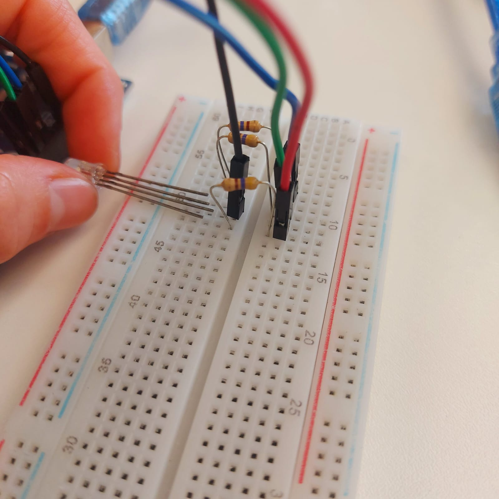
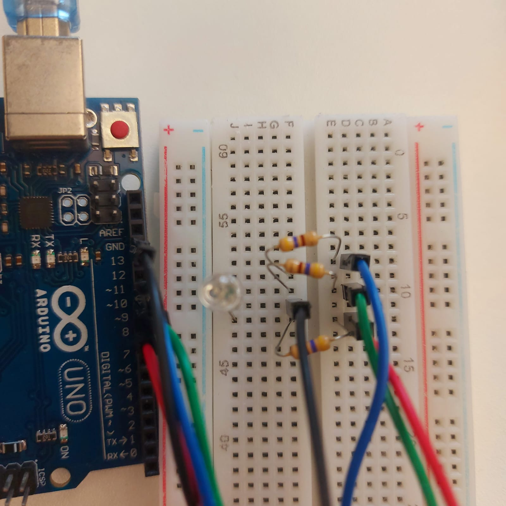

**Code**

                int redPin = 11;
                int greenPin = 10;
                int bluePin = 9;

                void setup(){
                pinMode(redPin, OUTPUT);
                pinMode(greenPin, OUTPUT);
                pinMode(bluePin, OUTPUT);
                }

                void loop() {
                delay(300);
                setColor(255, 0, 0); //red
                delay(1000);
                setColor(0, 255, 0); //green
                delay(1000);
                setColor(0, 0, 255); //blue
                delay(1000);
                }

                void setColor(int red, int green, int blue) {
                analogWrite(redPin, red);
                analogWrite(greenPin, green);
                analogWrite(bluePin, blue);
                }

## Constant
- Allows you to give a name and a meaning to a value
- The value cannot change during execution 
- Allows you to isolate the numerical values (the configuration) in one place
- Writen with fullupercase and (_) for dividing names
- Constant don't need to end its lines with (;).

                #define LED 13 
                void setup() { 
                  pinMode(LED, OUTPUT);     
                } 

## Variable
- Allows you to assign a name to a value
- The value can change during the execution of the program
- The value is used instead of the name
- Boolean = variable that can only have 2 states (True/False)
- val = variable box where you can store a value

                #define LED 13 
                boolean val = HIGH; 
                void setup() { 
                  pinMode(LED, OUTPUT);     
                  digitalWrite(LED, val); 
                }

- (!) = negative

val = !val; //the value should change to its opposite everytime it is called

                #define LED 13
                boolean val = HIGH;

                void setup() {
                pinMode(LED, OUTPUT);
                
                }

                void loop() {
                digitalWrite(LED, val); //call the variable val (turn the led hight)
                delay (1000);
                val = !val; //call the variable val again but negate it (if the light is on, it turn off. If it is off, it turns on)
                }

### *Button turn on/off LED*
**Build**
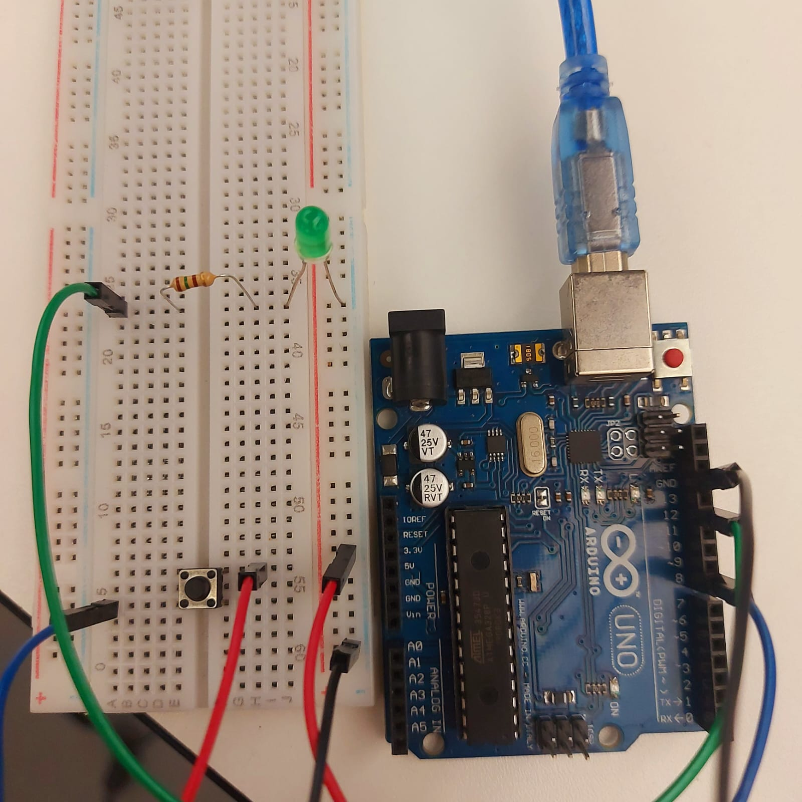
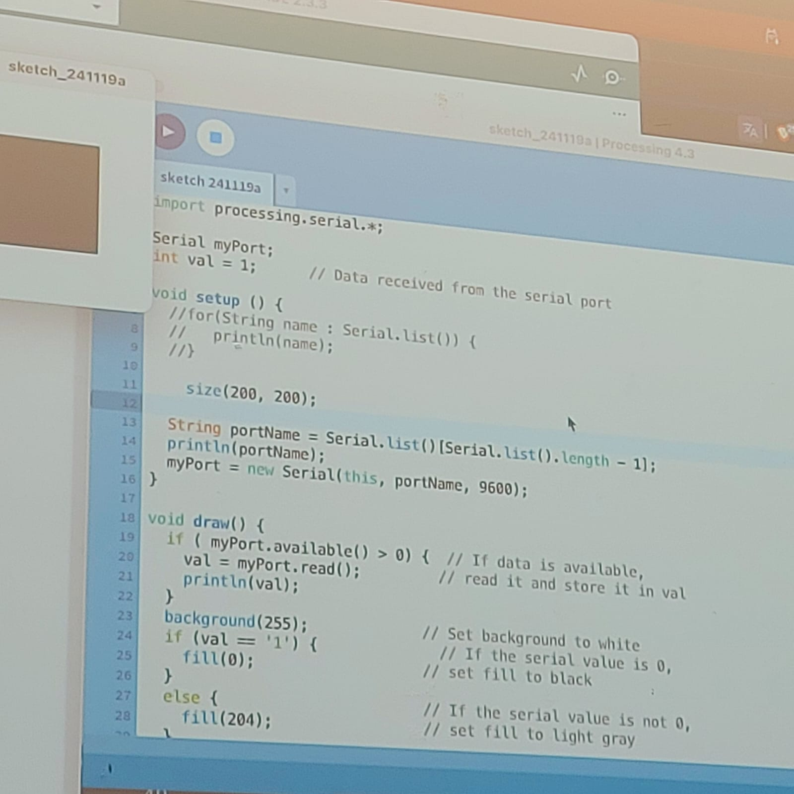

**Code**

                #define LED 12
                #define BUTTON 8

                void setup() {
                pinMode(LED, OUTPUT);
                pinMode(BUTTON, INPUT_PULLUP); //connect the button to arduino internal resistor, which connects to the 5v
                
                Serial.begin(9600);
                }

                void loop() {
                boolean val = digitalRead(BUTTON);
                digitalWrite(LED, val);

                //Serial.println("Hello\n\n\n...."); // \n = new line
                //Serial.println("A\tB\tC"); // \t = tab

                Serial.println(val);
                delay(100);
                }

### *Potentiometer*
Have 3 pins: Positive (5v), Voltimeter (A0), Zero (GND)
The position of the positive and ground can be switched, which will change the direction the potentiometer needs to be turned to (where the 0 and 5v stands).
The middle pin is always the reading. Is the neddle that changes position when the potenciometer is turned, positioning itself between the values of the circular resistor (between 0Ω and 10kΩ), increasing or decreasing the resistance value.

**Build**

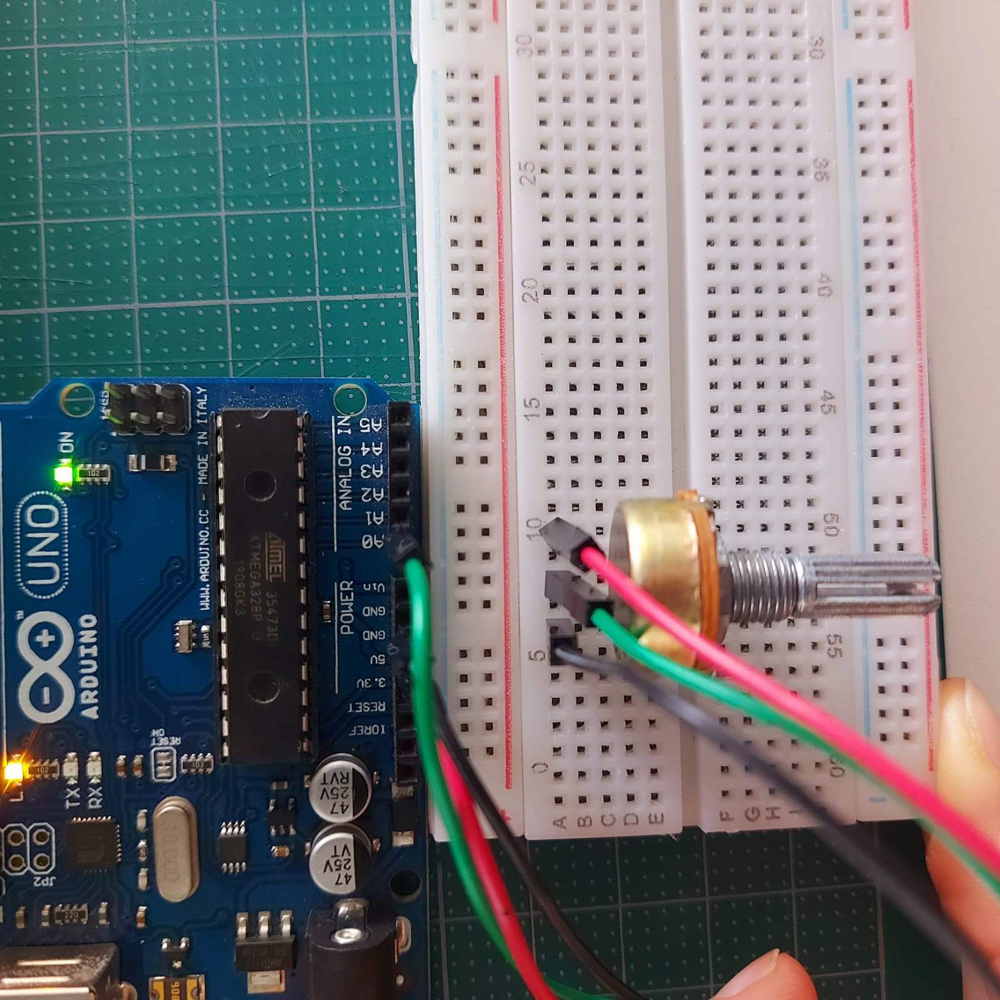

**Code**

                void setup() {
                // put your setup code here, to run once:
                Serial.begin(9600);

                }

                void loop() {
                // Read an analog input, which returns a value between 0 and 1023 (because it has a 10bits memory - 2¹0)
                int a0 = analogRead(A0);

                //convert analog input to voltage in millivolt
                //long value is an interger (int)
                long voltage = map(a0, 0, 1023, 0, 5000);

                //in this first case, since the float = "voltage", that is already an int, there is no decimal house
                //float volts = voltage / 1000;

                //in this case, multipling 1000 by 0, gives the voltage 2 decimal houses
                float volts = voltage / 1000.0;

                Serial.print(a0);
                Serial.print("\t");
                Serial.print(voltage);
                Serial.print(" mV\t\t");
                Serial.print(volts);
                Serial.println(" V");

                delay(100);
                }

**Potentiometer + Processing (moving a rectangle based on the potentiometer value)**

The same code above was used, and the value from the potentiometer was passed to processing through IDE serial monitor (the serial monitor window must be closed in order for processing to be able to make the reading in the same the port).

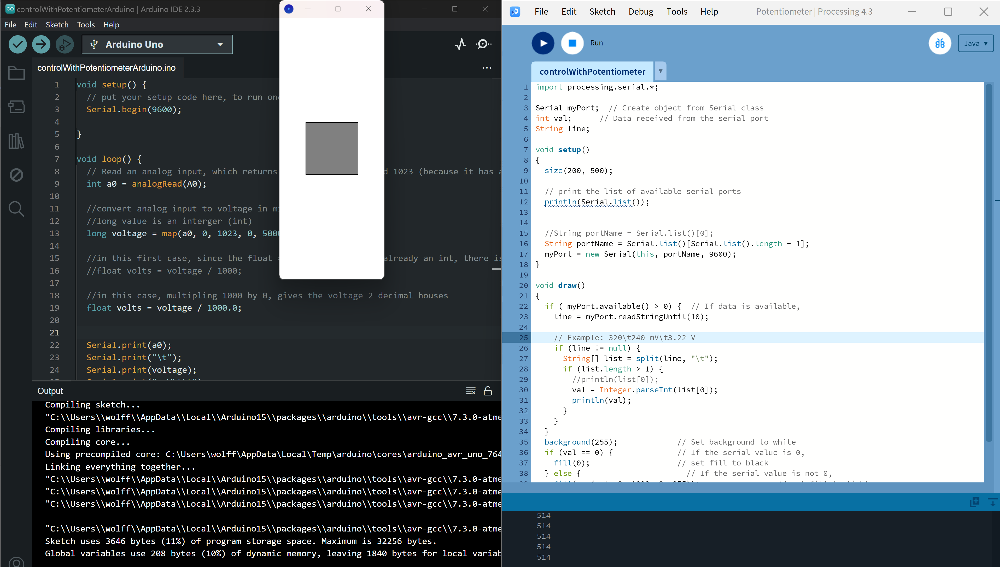

**Potentiometer LED dim**

Using a potentiometer to dim a light.

**Build**

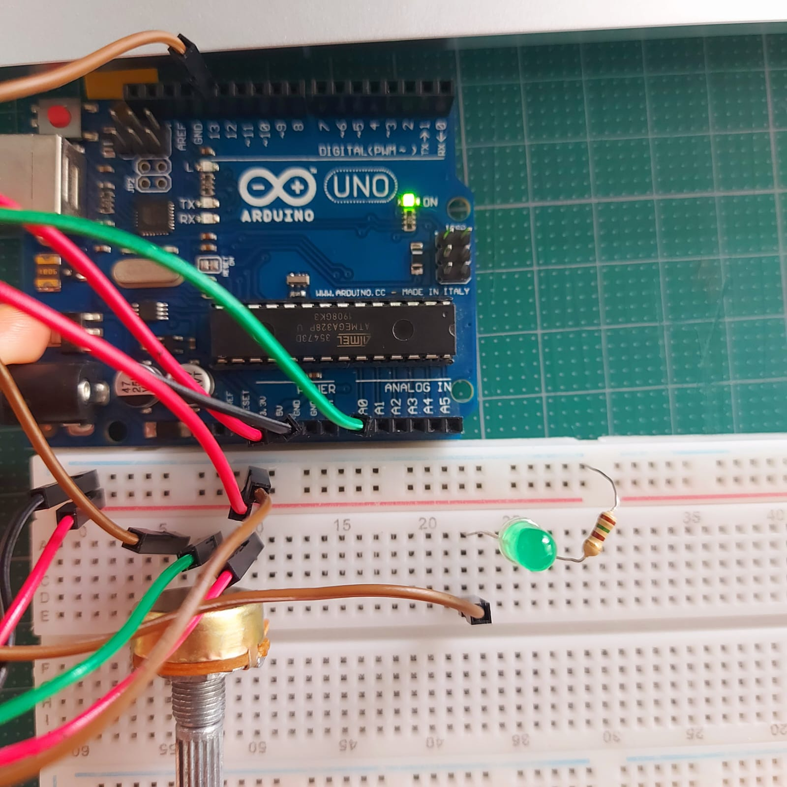

**Code**

                #define LED 13
                int lum = 15; //brightness between 0 and 20

                void setup() {
                pinMode(LED, OUTPUT);
                }

                void loop() {

                //read the potentiometer value
                int a0 = analogRead(A0);

                //map the range of the potentiometer to the lum of the light
                lum = map(a0,0,1023,0,20);

                //translate the value of the potentiometer to the value on the LED
                digitalWrite(LED, HIGH);
                delay(lum); 
                digitalWrite(LED, LOW);
                delay(20 - lum);
                }   

### *Servo Motor*
- Have 3 pins: Positive (5v), Signal (D2), Zero (GND)
- A simple servo motor can be connected directly to the 5v of the arduino.
- If the motor needs mor current that arduino can provide (5v/200mA), you need to use an external power supply. 
In that case you will need one loop to control the digital port (linking servo to arduino) and one loop to connect the motor to the power supply (gnd + 5v).

**Build**

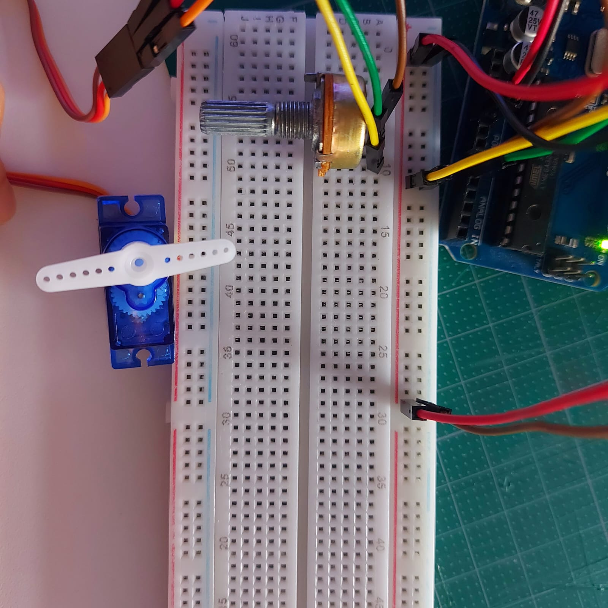
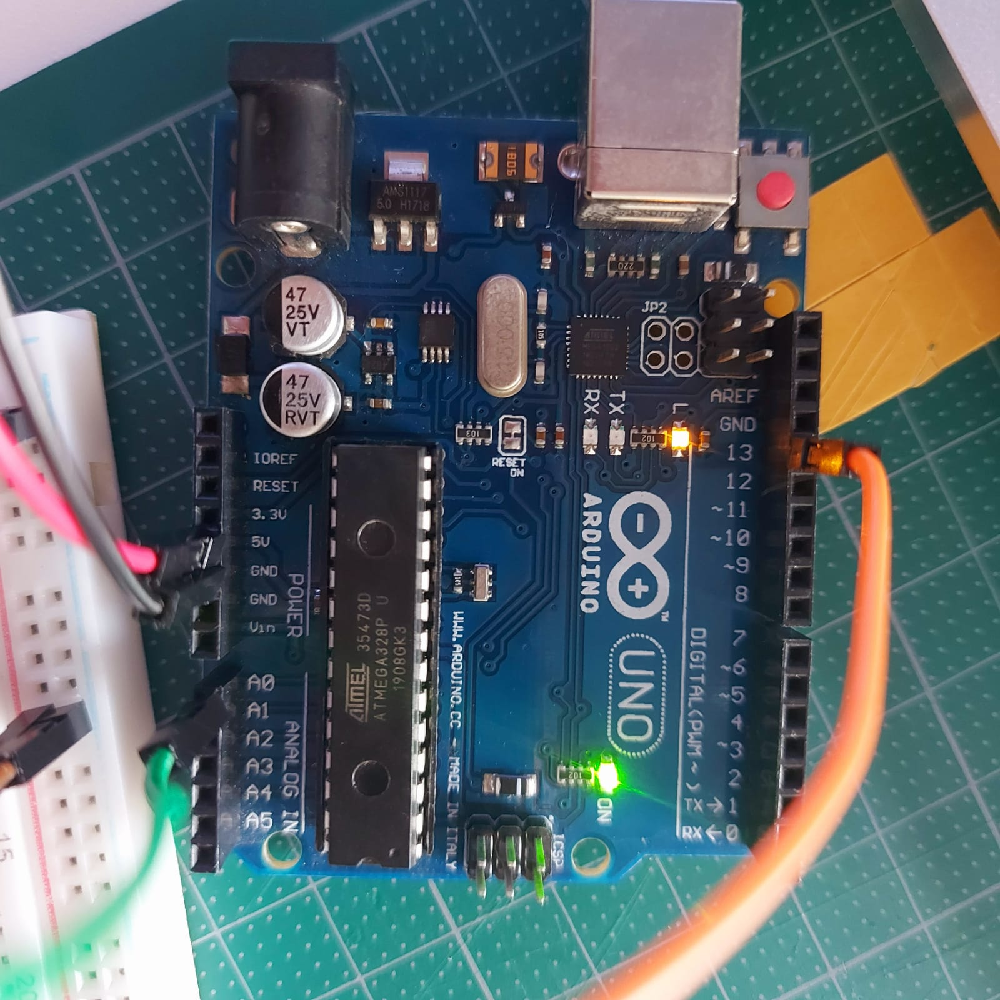

**Code**

                #include <Servo.h>

                Servo myservo; //create servo object to control the servo

                int potpin = A0; //analog pin used to connect the potentiometer
                int val; //variable to read the  value from the analog pin

                void setup() {
                myservo.attach(13); //attaches the servo on pin 9 to the servo object
                }

                void loop() {
                val = analogRead(potpin);
                int angle = map(val, 0, 1023, 0, 180);
                myservo.write(angle);
                delay(15);
                }

### *Light Sensor (LDR)*
- Work the same way as a normal resistor
- Need a 10k resistor.

**Build**

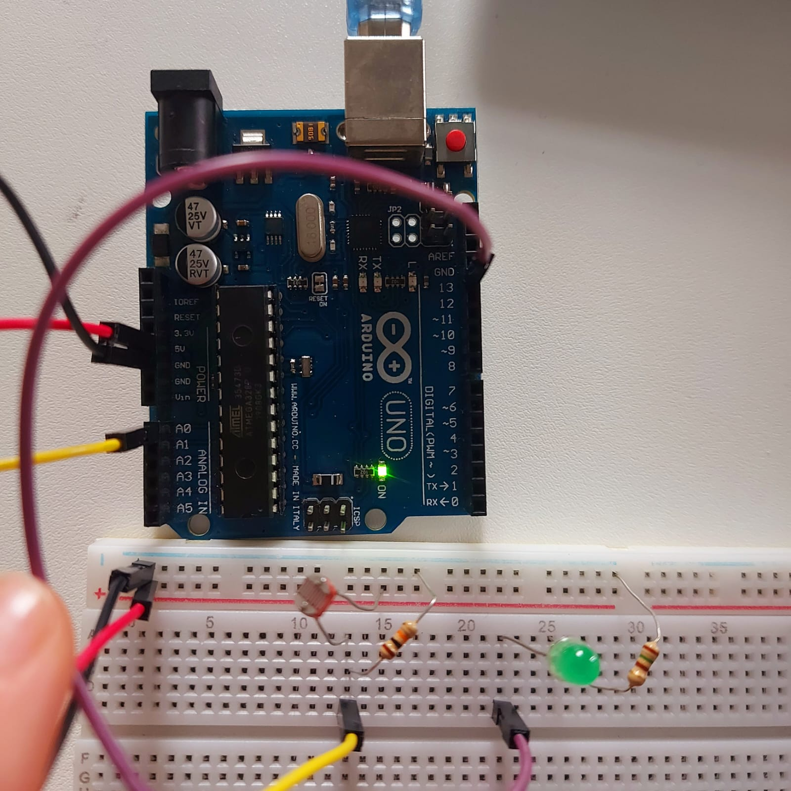

**Code**

                const int LIGHT_SENSOR_PIN = A0; // Arduino pin connected to light sensor's  pin
                const int LED_PIN = 13;  // Arduino pin connected to LED's pin
                const int ANALOG_THRESHOLD = 600;
                // variables will change:
                int analogValue;

                void setup() {
                pinMode(LED_PIN, OUTPUT); // set arduino pin to output mode
                }

                void loop() {
                analogValue = analogRead(LIGHT_SENSOR_PIN); // read the input on analog pin
                if(analogValue < ANALOG_THRESHOLD)
                digitalWrite(LED_PIN, HIGH); // turn on LED
                else
                digitalWrite(LED_PIN, LOW);  // turn off LED
                }

### *Ultrasonic Sensor*
- The ultrasonic sensor is a device that can measure distances using sound waves . It works in a similar way than bats and dolphins - by emitting sound waves and listening them bound back.
-  It uses the speed of sound (340m/s).
- The sensor consists of two primary components: a transmitter and a receiver .
- When the sound wave hits an object, it bounces back like echo. 
- This returning wave is detected by the receiver. The sensor will use the micro-controller (Arduino) internal clock to find out how much it took for the sound to bounce back.
- Then, we can use this information to calculate the distance between the sensor and the object. 

                [Distance = Velocity * Time]
                
But if we multiply this speed with the timing we found, we'll discover a value that's twice the real distance. That's happens because the sound hit the object and came back

                Distance = (Velocity * Time) / 2 

**Build**

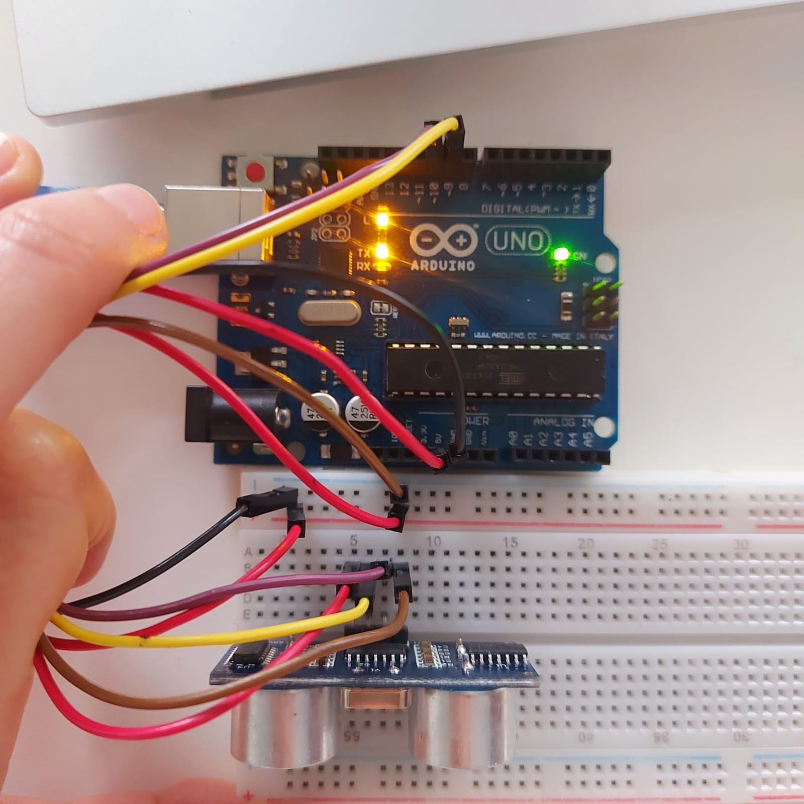

**Code**

                const int trigPin = 9;  
                const int echoPin = 10; 

                float duration, distance;  

                void setup() {
                pinMode(trigPin, OUTPUT);  
                        pinMode(echoPin, INPUT);  
                        Serial.begin(9600);  

                }

                void loop() {
                digitalWrite(trigPin, LOW);  
                        delayMicroseconds(2);  
                        digitalWrite(trigPin, HIGH);  
                        delayMicroseconds(10);  
                        digitalWrite(trigPin, LOW);  

                duration = pulseIn(echoPin, HIGH); //When the sound waves hit the receiver, it turns the Echo pin high
                distance = (duration*.0343)/2; //time x speed = distance. Speed of sound = 340m/s

                Serial.print("Distance: ");  //print results
                        Serial.println(distance);  
                        delay(100);  
                }

## Soldering

1. Clean the tip of the solder iron with a brass sponge until it is shiny
2. Heat the solder iron to 350 - 400 degrees
3. Wet the tip of the iron with a drop of solder wire
4. Heat the hole pad and part leg with the tip of the solder iron for 2-3sec
5. Touch the heated pad with the solder wire (not to the solder iron!). The parts should be hot enough to melt the solder wire themselves.
6. Add solder wire to both sides of the pad  (continue heating for 1-2 sec)
7. Let it cool (don't blow)
8. It should have a shiny, volcanic conical form

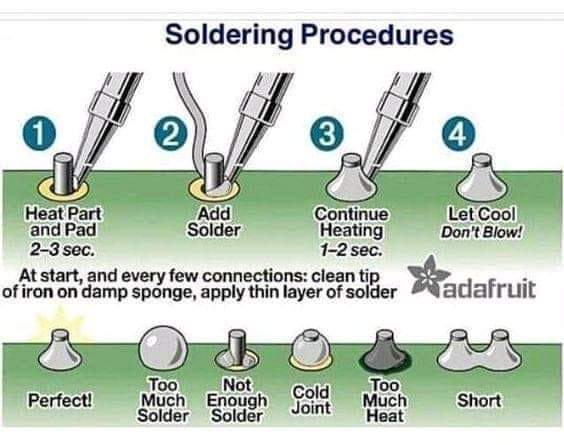

**Removing solder/Cleaning motherboard**
1. Use the solder pump to remove bigger amounts of solder
2. Use the wipping wire to remove smaller amounts of solder
3. Use a steel wool or sand paper (number 600 up) to completely clean the soldered motherboard and return the cooper conectivity.

## STATE MACHINE

How to divide different states in a same code.
State machine structure
State has a beginning and an end and takes some time during that two.
When I have to do something special for some time and then I have to do something else.a

**States:**
1. idle
2. watchig
3. barking
4. bite
5. greet

**Conditions:**
- Distance (D)
- Speed (S)
- Speed Limit (SL)

        (iddle) if D>500
                
        (watching) if D<500, S<SL
                
        (barking) if D<500, S>SL
                
        (greet) if D<200, watching
                
        (bite) if D<200, barking
                
**State exchange**
- idle>watching
- watching>greet
- greet>watching
- greet>barking
- barking>greet
- watching>barking
- barking>bite
- bite>barking
- barking>watching
- watching>idle

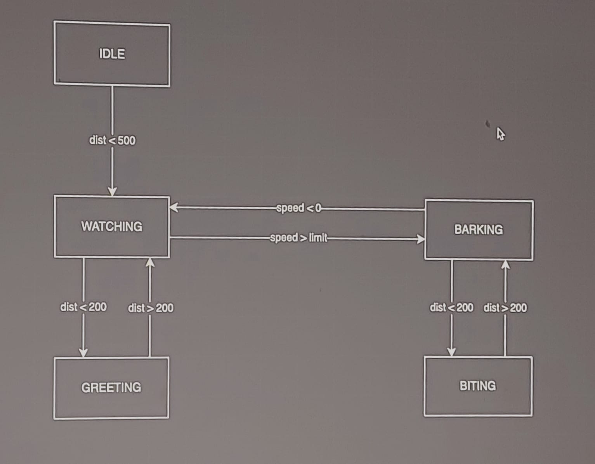