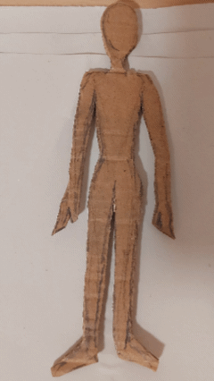

# Iteration: Skin
 For developing the project concept, a study on different possible iterations were sketched, prompt by words combination from the most relevant relations, movements and characteristics found during the field research about skin.

 ## **Iteractions 01** 
The first wave of iteration focused more on brainstorming the greater possible variety of possibilites of input-output combinations.

   

## **Iteractions 02** 
 For the second wave of iteraction, 3 main prototypes were drawn in a more complete way, focusing on the 5W design questions.

### Rooting

 **What**
    Its a rug robot that grows and warps around peoples feet when they pass by.

**Where**
- *Living room* - Since the living room it's a place where people tends to stay longer periods of time, socialize and relax, positioning the robot in such a place could invite longer interactions. This would allow the rug to be used in different forms and have different interactions with, such as being used for siting, laying down, as a playing mat, social gatherings, etc.
- *Hallway* - The rug could be positioned at a place of passage as part of the distance needed to cross to get to a final destination. This would allow to add time as a variable of interaction, as the robot would have to be crossed; turning the act of passing throught in a tactile experience.
- *Bedroom* - The rug could be positioned at the feet of the bed, greeting the people as they wake up or go to sleep.

 **Who**
    It could be used by anyone, from children, to teenagers and adults. Taking into consideration its shooting up tentacools, it would not be recomended for babies or people with reduced mobility, as it could present some risks.

**How**
    The robot react to touch; being a rug, it will react most to people's feet, but it can also respond to different parts of one's body. As soon it is touched, it gets out of it's dorment state and grows around peoples feet, ancles and calves, warping softly around them and heating up.

**Why**
    The robot interaction prompts people to slow down and spend more time where they are.

+ Storyboard 

### Snuggle

 **What**
    This robot blanket connects to your smartphone, adding a layer around you with each notification. As layers grow, it becomes harder to get out, until you’re fully enveloped in its folds, in a cozy cocoon.

**Where**
   - *Living room* - It could be used in a couch, as a blanket to be used when people are feeling sluggish and just want to lay down and stay where they are.
   - *Bedroom* - As a bed sheet, this robot could help people stay a little more in bed and sleep for "just 5 more minutes".
   - *Portable* - The robot could be used as a portable blanket, just thrown over the person's head or shoulders while they walk around, prompting they to cuddle and sleep whenever they want.

 **Who**
    For anyone +5
 
**How**
    The first layer of the robot can be warped around the person's body and, from that on, it will recognize the person's presense and connect to its cellphone. It reacts by growing new layers every time a new notification arrives on the smartphone.
 
**Why**
    The robot interaction prompt people to get a break and detach from the excessive information around they.

+ Storyboard 

### Shiver

 **What**
    This robot has a textured 3D surface that responds to touch. As the user strokes it, sensors detect the movement, expanding the surface in that area. When the hand moves, the texture follows it and the expanded spots return to their original form.

 **Where**
   - *Living room* - The robot could be used as a pillow in the couch, living as a companion to be hugged or strocked during more introspective moments like reading, daydreaming or movie nights.
   - *Bedroom* - It could be used on the bed for similar activities as in the living room, or be built in a bigger format to be used on the floor as a surface to lay down and roll over or stretch, as it would react to people's bodies and positions. 
 
 **Who**
    For anyone +3
  
**How**
    The robot react to touch and responds by ondulating itself to follow the movement/position of the touch.
 
**Why**
    It offers companionship     

+ Storyboard 

 
   

