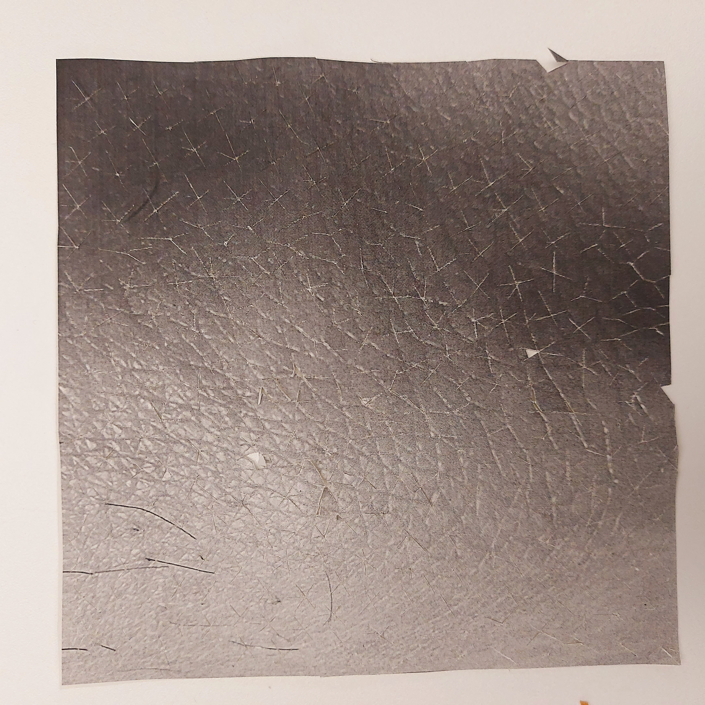

# PRODUCT DESIGN

## Context

**Basic project informations:**
- What is the *Identity/Values* of the client?
- Who are the final *users*?
- Where is the *physical environment (indoor/outdoor/home)* where the project is going to occupy?
- Who has *similar projects/products* - what already exist/competitors
- What is the *budget*?
- What *material ressources* do you have to produce it (related to the values of the project + feasability)?
- When doest it need to be done (*time available*)?

**Moodboard**

Reference images that link to the skin project (shape/aesthetic,colors), that can be continuosly revisited to guide the project development.

## Insights
**1- Start sketching**
(paper/3D/collages)
- become physical as soon as possible [come out of head]
- help think about details/how it should be assemble
- test basic shapes/volumes
- work in real scale to understand 1:1 physicality
- how to manipulate the object
- express the concept

**2- Test different scenarios with different users**

- vessel iterations, references (what is a bowl? - two hands/ceramic/sand/leaf) 
- what parts are important for you where you stand?
- different interpretation
- what is the most important part of the object?
- how can you scale it?

**3- Paper prototypes**
 - Filigree (move/change shapes/different pieces of paper puted together)
 - Weaving
 - Structures/mesh (pieces of paper assembled together) - gives another volume/appearence - patterns
 - Pleats (origami/repeating) - christophe Guberan (printing water patterns on paper to make it retract on specific places)
 - Narrative cut-outs (pop-up)
 - Playing with elements (air/water/earth/fire) - kites, Adrianus Kundert, Pinaffo Pluvinage (papier machine: conductive ink)

## Skin prototypes

 1- **Skin A**

 Skin cut
     

Rapport
     

Pattern
     

Movement
     

 2- **Skin B**

Skin cut
     

Rapport
     

Pattern
     

Movement
     

  3- **Skin C**

Skin cut
     

Rapport
     

Pattern
     

Movement
     
     
     
 4- **Skin D**

Skin cut
     

Rapport
     

Pattern
     

Movement
     

5- **Skin E**

Skin cut
     

 Rapport
     

Pattern
     

Movement
     

6- **Skin F**

Skin cut
     

Rapport
     

Pattern
     

Movement
     
     

 7- **Skin G**

Skin cut
     

Rapport
     

Pattern
     

Movement
     

 8- **Skin H**
     
Skin cut
     

Rapport
     

Pattern
     

Movement
     

### Movements
Research focused on reproducing the skin movement of warping around an object with folding paper.

 
 
 
 

### Collection
 
 
 