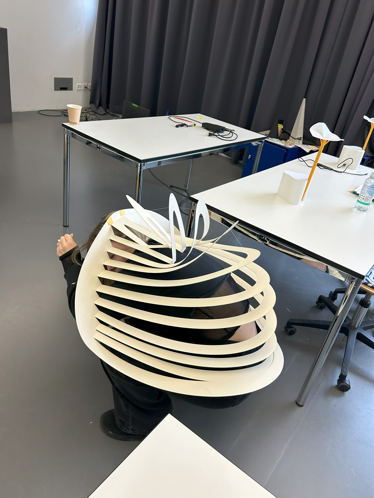
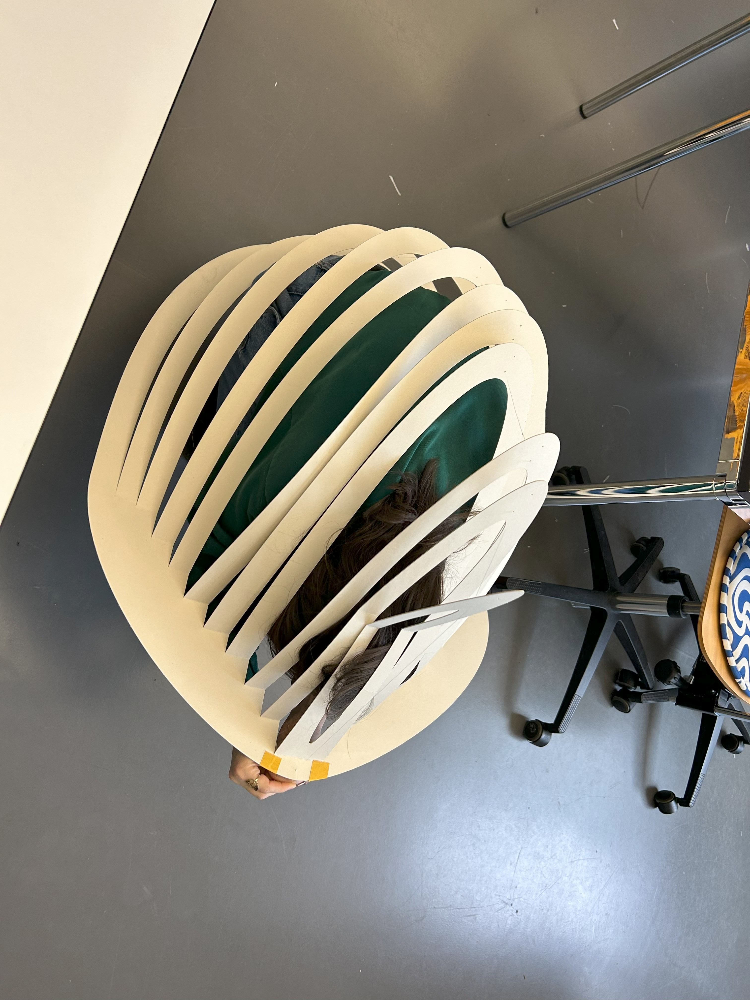
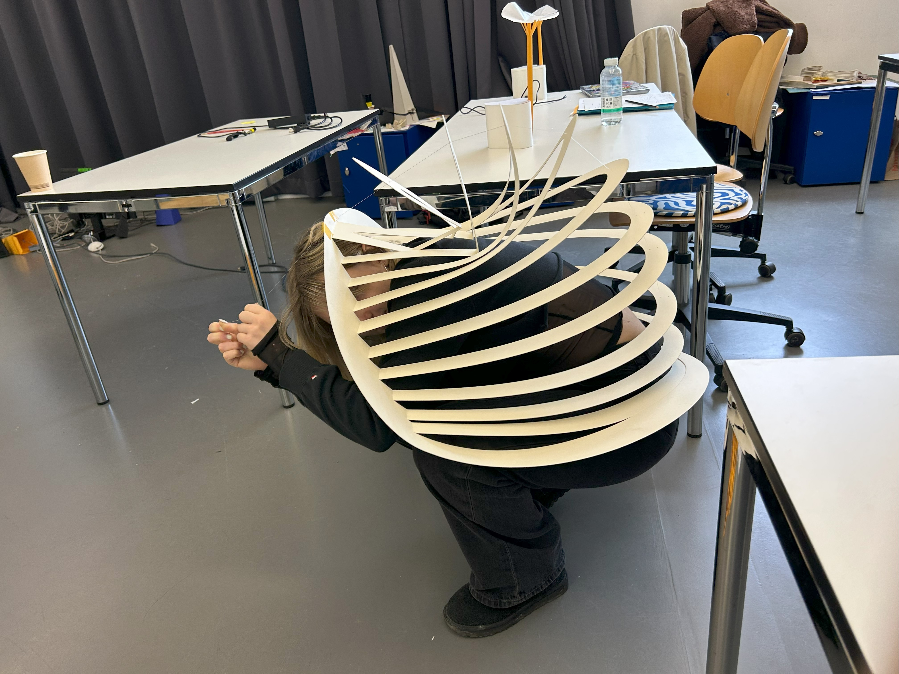
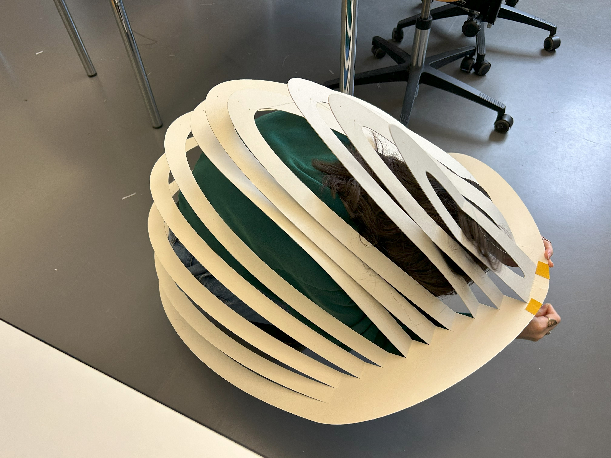

# Testing Day

## Questions
1. How people interact with it? What movements/gestures they do?
2. How they react/interact with the movement?
3. How different sizes modules are perceived?
4. Where should it be placed?
5. Can you wear it?

## Inputs
**How people interact with it? What movements/gestures they do?**

        - Caress it
        - braid it
        - fold it
        - lay down
        - walk over

**Other observations:**
- Looks like guitar pedals: make you want to step on them
- looks confortable to lay down: It would be nice if they would move around you when you are over it, adapting to your shape.
- It's satisfying to walk over it
- Seems soft
- Seems like fingerprints
- White looks better than colorful

**How they react/interact with the movement?**
- The movements seems like a breathing creature 
- its soothing/relaxing
- Chill interaction
- syncronized waves movements would be great

**How different sizes modules are perceived**
- Big module - feels like exposition piece (more artistic - imponent)
- Medium module - feels more in context with a home environment/closer to the user. Seems more like a Design Object
- Small module - desk piece; for relaxation

**Where should it be placed**
- The composition on the floor seems fragile and precious - wouldn't step on it (its fancy/organic) - would feel more confortable to interact if it was on the wall.
- Very architectual (nice playing with light and shadows) - It would be cool to be able to walk inside it

**Can you wear it?**
- The big one can weared as a bag
- The small one can weared as a ring
- It could be weared as an umbrella, over the back like a turtle
- They could all be activated by the user body movements
- Could move faster/slower depending on the wearer mood

