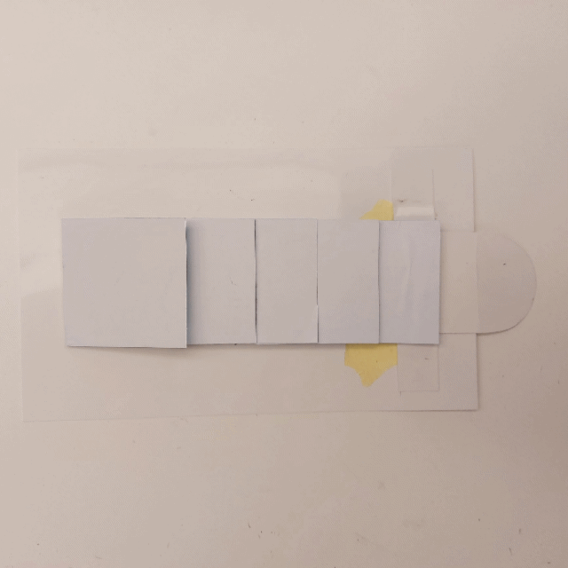

# Karina Wolff
- Soft Robots
- Master Media Design + O2R

## Project title 
Layers of Understanding

## Research Question
How can we use touch to connect ourselves to our surroundings?

## Pitch
My project is a textured floor surface that unfolds in different shapes, textures and colors reacting to how people approach it.

**Key visuals:** 
1. Unfolding layers

2. Textured surface

## Prototyping research
My prototype research was divided into two main subjects: textures and gestures. First, following the results obtained from my last experiment with Skin mapping, I printed and made cut outs guided by the textures of the photographs. That led to the identification of the patterns and rapports contained into the skin surface and also to the understanding of how to reproduce them to obtain specific desired touches. 

After that, I played with the textured flat surfaces, trying to understand what kind of movements could enhance their properties and help the robot better communicate/interact with people. Considering the robot floor-dwelling nature, one of the most pressing problems was researching ways of getting it to grow from a flat surface into a 3D structure and back to flat, in order to allow passage and also protect it from people steping on it.

## Key prototype
It is a 3 layered robot with 4 states: while in **idle** mode, it spends most of its time contemplating the meaning of the universe, in a meditative state. If it identifies a presence, it **freezes**, losing track of its thoughts and changes its whole attention to the presence and its possible dangers. If the presence approaches too fast, it identifies it as a treat and grows **violent**. If the presence approaches it slowly, taking time to make its acquaintance, it grows fond of the person and allows to be touched, becoming **cuddly**.

+ State: Cuddly

+ State: Violent

## User scenario

## Next Steps
Keep working on the 3 states movements and test ways to integrate them among themselves as well as automatize the movements through electronics.