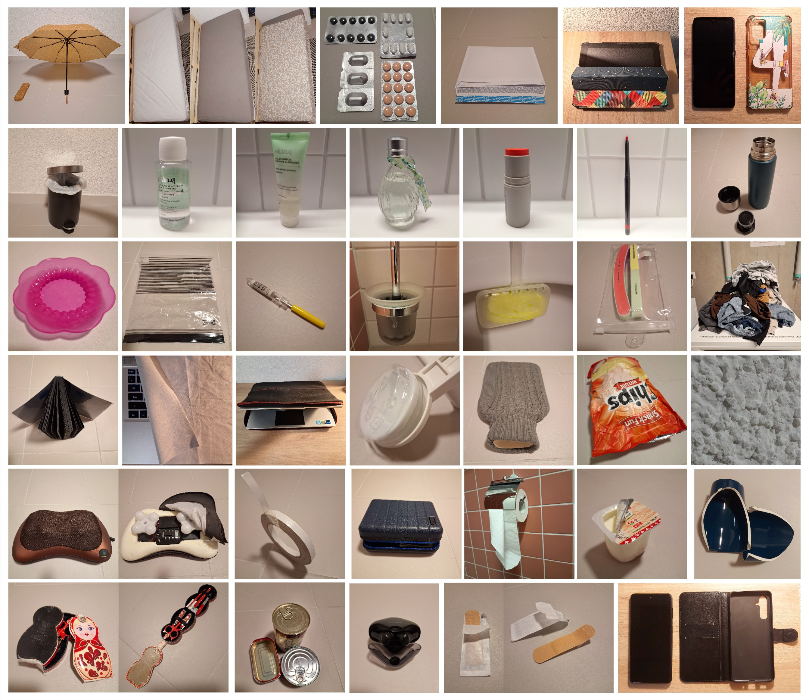
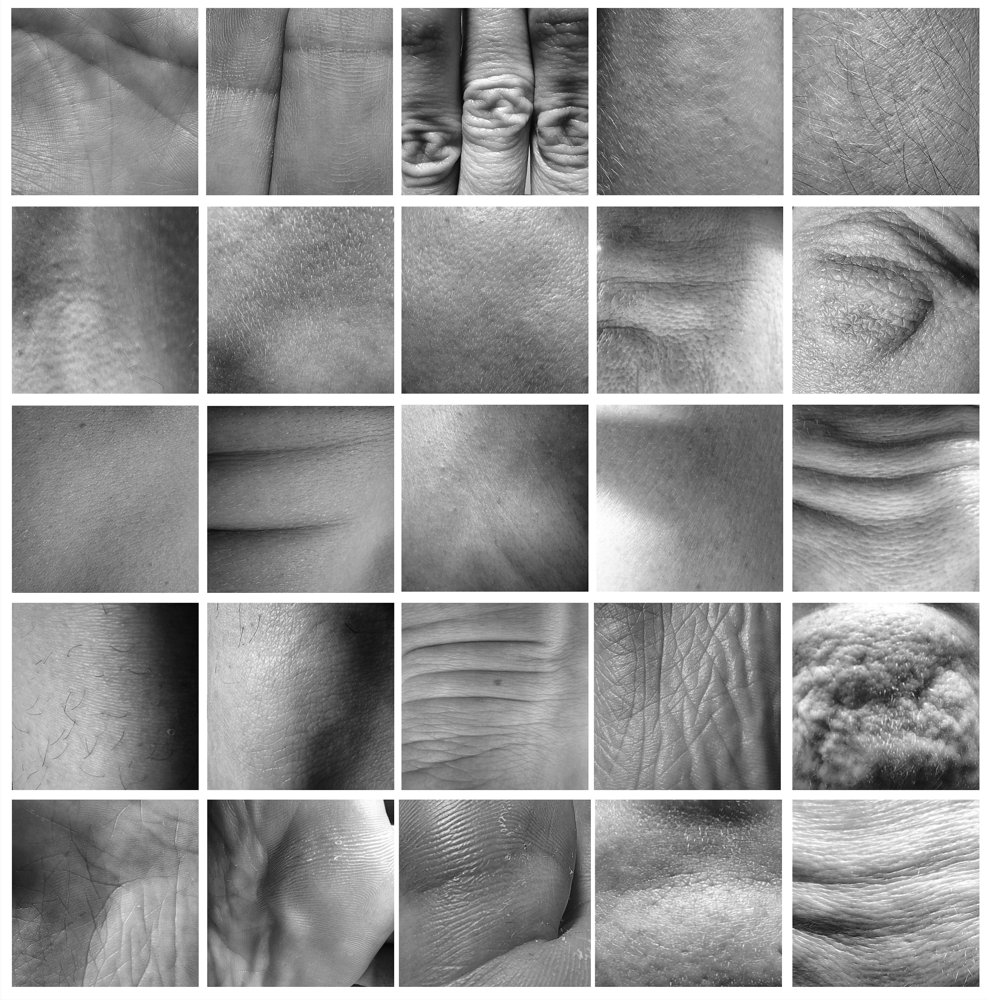

# Karina Wolff
- Soft Robots
- Master Media Design + O2R

## Area of intervention
Our skin as a home environment.

+ Skin species 
+ Skin mapping 

## Research Question
How can we use touch to connect ourselves to our surroundings?

## Research
Describe in a short paragraph (~1000 chars) the research that you have conducted around your core questions. Mentions your research methods: interviews, observations, questionnaires, et cætera. Illustrate each method with corresponding data, photo, sketches, audio, movies, etc. You can put a lot of elements here, but please curate the most illustrative materials.

## Insights
- The skin is the largest interface between a body and the outer world and imediate surroundings.

## First ideas & prototypes
Show three of your prototypes.

### Name of first prototype
Short paragraph (~250 chars) describing the prototype.

+ One photo of the prototype (can be gif animation, or static)
+ One storyboard of the prototype
+ (Optional) Audio
+ (Optional) Video

### Name of second prototype
Short paragraph (~250 chars) describing the prototype.

+ One photo of the prototype (can be gif animation, or static)
+ One storyboard of the prototype
+ (Optional) Audio
+ (Optional) Video

### Name of third prototype
Short paragraph (~250 chars) describing the prototype.

+ One photo of the prototype (can be gif animation, or static)
+ One storyboard of the prototype
+ (Optional) Audio
+ (Optional) Video

## Next Steps
In one sentence, describe what you will focus on next.