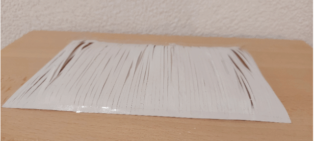

# Karina Wolff
- Soft Robots
- Master Media Design + O2R

## Area of intervention
The skin as a home.

## Research Question
How can we use touch to connect ourselves to our surroundings?

## Research
My first observations were focused on understanding how a skin can be identified and what could or could not be considered a skin. That led to a series of photographs and the description of different skin subspecies, which helped me build an understanding on what kind of gestures, actions, interactions and relations could be found within them. I also performed a skin mapping, trying to identify the diversity of skin patterns and behaviors within the same continuous human surface. From there, I went to sketching and testing with different re-combinations of the previously collected data, trying to think of new meaningful connections.

+ Skin subspecies 

+ Gestures, actions, interactions and relations 

+ Skin mapping 

+ Sketching 

## Insights
- The sense of touch is mostly able to identify changes related to temperature and resistance (friction/volume)
- There are specific gestures that create immediate allusion to skins (peel off, envelop, pinch)
- The same skin can have different patterns defined by its location, movement or friction.

## First ideas & prototypes
Show three of your prototypes.

### Rooting
This rug robot has modular, fur-like straws that respond to footsteps. As someone stands on it, sensors detect pressure, causing the fur to tense and “grow” around their feet. The base modules heat up, creating a warm, comforting zone around each foot.

+ Prototype

+ Storyboard 

### Snuggle
This robot blanket connects to your smartphone, adding a layer around you with each notification. As layers grow, it becomes harder to get out, until you’re fully enveloped in its folds, in a cozy cocoon.

+ Prototype

+ Storyboard 

### Shiver
This robot has a textured 3D surface that responds to touch. As the user strokes it, sensors detect the movement, expanding the surface in that area. When the hand moves, the texture follows it and the expanded spots return to their original form.

+ Prototype 
+ Storyboard 

## Next Steps
Develop a new series of prototypes, pushing further the main concepts of warping, thickness (layers), creation of textured patterns and augmented touch.